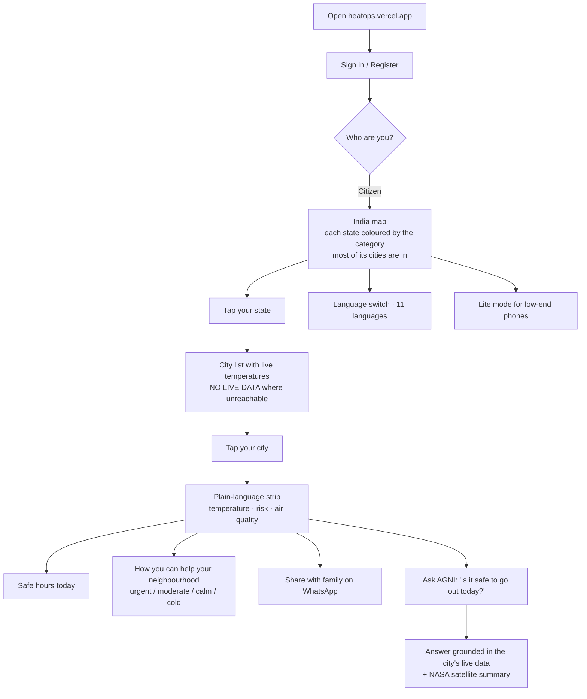
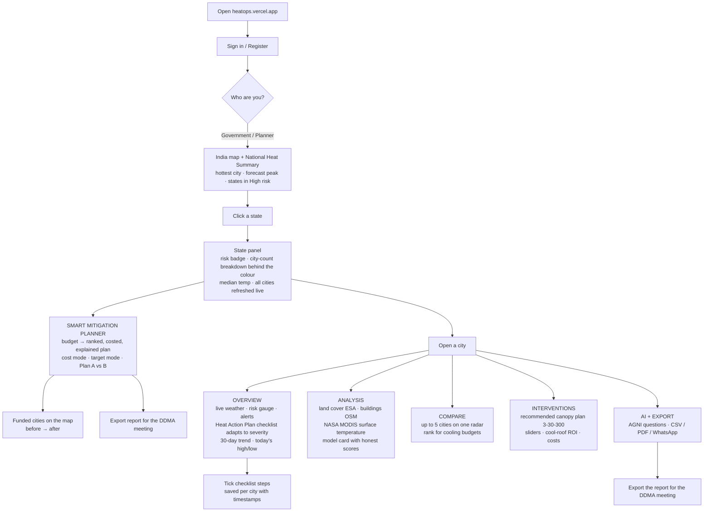
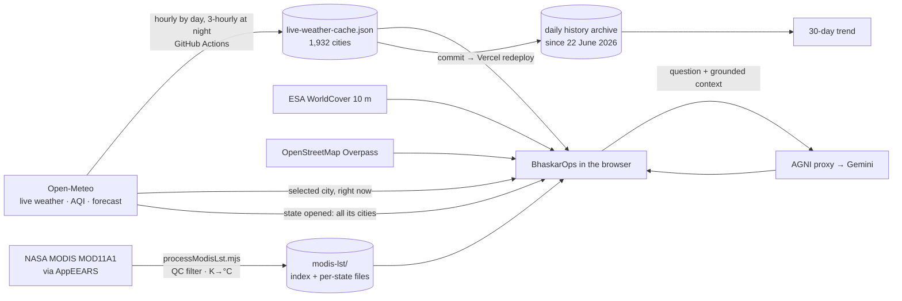

# BhaskarOps — The One Document

*Everything needed to present, demo and defend BhaskarOps, in one file. Facts match the live product at https://heatops.vercel.app on 8 September 2026. The technical deep-dive (how each part works, dated change log) is `PROJECT_EXPLAINED.md`; the morning-of freshness checklist is `REFRESH_BEFORE_JUDGING.md`. Nothing else is needed.*

**Contents**
1. [In one page](#1-in-one-page) — problem, solution, USP, honesty
2. [What you say — the presentation script](#2-what-you-say--the-presentation-script)
3. [What you click — the 8-minute demo path](#3-what-you-click--the-8-minute-demo-path)
4. [Every feature, small to large, and the flow charts](#4-every-feature-small-to-large-and-the-flow-charts)
5. [Slide-by-slide content](#5-slide-by-slide-content)
6. [Where we stand — IMD, BHRIGU, equity](#6-where-we-stand--imd-bhrigu-equity)

---

## 1. In one page

### Title
**BhaskarOps** — India's live urban-heat platform, with **AGNI**, an AI analyst grounded in real data.

Live monitoring for 1,932 Indian cities. Plain-language guidance for citizens. Action playbooks for officials.

[Suggested visual: full-bleed screenshot of the India heat map with the BhaskarOps wordmark]

### The Problem in One Line
Indian cities are getting hotter, the data to act already exists — but it sits in silos nobody can use in time.

Citizens don't know *why* their city is hot. Officials have no live, city-level picture. Most tools are English-only or show fake numbers.

[Suggested visual: three-icon row — citizen, official, siloed databases]

### Our USP in One Line
**"A heat dashboard you can show a judge, a planner, or a citizen — and every number survives the question 'where's that from?'"**

[Suggested visual: single bold statement slide]

### What BhaskarOps Does
- Live heat map of India, coloured by real city temperatures
- 1,956 cities across all 28 states and 8 UTs; 1,932 with live readings
- City dashboards: weather, satellite indices, comparisons, interventions
- Citizen view and Authority view — two audiences, one product
- AGNI: ask questions in plain language, in 11 Indian languages

[Suggested visual: dashboard screenshot with the five tabs highlighted]

### Smart Mitigation Planner — the Decision Engine
**"I have ₹1 crore for heat mitigation. Where should it go?"**

STEP 1: Budget → preset or custom amount
STEP 2: Rank → every city in the state scored on forecast high, NASA satellite peak, built-up share, canopy gap
STEP 3: Optimise → the budget is spent where each rupee removes the most projected risk (roofs, plantation, cooling centres, water, reflective surfaces, schools and hospitals)
STEP 4: Explain → "Why this plan?" in plain sentences, every unit cost printed
STEP 5: Decide → before/after, funded cities on the map, Plan A vs Plan B, export for the DDMA meeting

Also: "What does +5 % canopy cost in Bikaner?" and "What budget reaches a 10 % reduction?" — same engine.

[Suggested visual: planner screenshot — ₹1 Cr allocation bars, before/after cards, map markers]

### Radical Honesty, Enforced in Code
- Every number is traceable to a named source
- Cities without a reading say "NO LIVE DATA" — nothing is estimated
- Stale readings are flagged "carried forward" with their real time
- Illustrative values (intervention model, baseline indices) are labelled as such
- The ML model shows its weak score next to its good one

[Suggested visual: screenshot collage of the honesty labels]

---

## 2. What you say — the presentation script

*A spoken script, not a click list. Say it in your own words; the facts are exact as of 8 September 2026 and every one of them can be shown live at https://heatops.vercel.app. The click path with timings is in section 3; this section is what you say while you click.*

Speak slowly. Judges remember three things: the problem, the one thing only you do, and the moment you were honest about a limit.

---

### 1. Opening (30 seconds)

> "Good morning. I am [name], and this is BhaskarOps — Bhaskar for the sun, Ops because it is built for the officer who has to act.
>
> Every summer, heat kills more Indians than floods or cyclones, and most of those deaths are in cities. The India Meteorological Department already tells a district *how hot* it will be and *when*. What no one tells a District Magistrate is *where* in their district the heat is worst, *why* it is worst there, and *what to spend their limited budget on*.
>
> BhaskarOps answers those three questions, for 1,956 cities, live, and it never shows a number it cannot trace."

---

### 2. The problem, in the judges' language (45 seconds)

> "Three gaps.
>
> **First, granularity.** Warnings are issued per district. Heat is not felt per district. A tin-roof colony and a tree-lined cantonment in the same district are ten degrees apart on the ground.
>
> **Second, explanation.** A colour-coded alert says 'red'. It does not say 'red because 63 % of this city is built-up and its tree canopy is 17 % against a 30 % target'. Without the *why*, there is no *what to do*.
>
> **Third, money.** A District Magistrate gets a heat-mitigation budget and a list of possible measures — cool roofs, plantation, cooling centres. Nobody gives them a ranked, costed plan for their own district. So the money goes where the last meeting pointed."

---

### 3. The solution, in one breath (30 seconds)

> "BhaskarOps is a live urban-heat decision platform for government authorities. It fuses four real sources — Open-Meteo live weather, NASA MODIS satellite surface temperature, ESA WorldCover land cover, and OpenStreetMap — for every city in India, and it closes the loop: **monitor, explain, decide, act.**
>
> The one thing only we do: you type a budget, and it hands back a ranked, costed, explained mitigation plan for your state or your city — and every rupee in it is traceable to a printed assumption."

---

### 4. What the app looks like — walk-through (5 minutes)

Describe each screen as it appears. The words in bold are what is on screen.

#### 4a. Sign-in and the map (45 seconds)

*What they see:* a dark screen, a rotating Earth, a sign-in card. Then the India map: 28 states and 8 UTs, 594 districts, each state coloured green to red, small weather badges where it is raining or dusty, a ticker on top with the hottest city and worst air right now, and a **National Heat Summary** on the right.

> "This is the map as it is right now. Every state is coloured by the risk category *most of its cities are in*, from live readings — not an average that one desert town can drag. Hover a state and it tells you the count: 38 of 76 cities Moderate, 34 Low-Moderate. The colour rests on those numbers, and you can see them.
>
> On the right: the hottest city in India at this minute, today's forecast peak city, how many states are in High risk, and the national average. All from the same live cache, refreshed every hour by day."

#### 4b. A state, and the Smart Mitigation Planner (90 seconds) — the USP

*What they see:* click Rajasthan. The right column becomes the state panel: a risk badge, the city-count breakdown behind the colour, the median temperature, and the list of all 76 cities with live readings. Under the state name, an orange button: **SMART MITIGATION PLANNER — WHERE SHOULD THE MONEY GO?**

> "Imagine you are the state's heat officer. You have one crore rupees. Where does it go?"

*Click the button. A chip reads* **FOR THE STATE OFFICER / CMO — BUDGET ALLOCATION ACROSS CITIES.** *Click* **₹1 Cr** *then* **OPTIMIZE MY PLAN**.

> "In under a second: Bikaner, Jaipur, Jodhpur, Kota. Ranked on four real inputs — the forecast high, NASA's season-peak surface temperature for that city, ESA's built-up share, and the tree-canopy gap. The budget is spent where each rupee removes the most projected risk: plantation and cooling relief here, ₹99.6 lakh allocated, the ten highest-risk cities move from 78 to 76 on our composite score.
>
> Two things I want you to notice. The **Why this plan?** box explains the choice in sentences — a finance officer can argue with it. And the word **projected** is on every outcome, with a confidence tag."

*Click* **VIEW ON MAP** *— four markers appear with before → after. Click one.*

> "Each funded city opens with its inputs and its packages: so many roofs, so many hectares, a cooling centre."

*Click* **SAVE AS PLAN A**, *then* **₹50 L**.

> "Change the budget and it re-optimises live — Plan A against the current plan, side by side. This is not a page of numbers. It is a constraint solver."

*Click* **COST ASSUMPTIONS & METHOD**.

> "Every unit cost is printed. The cool-roof rate comes from the Ahmedabad 2017 pilot tier. The rest are stated assumptions a state can replace with its schedule of rates. And one line you will not see in most prototypes: **population is not modelled**, because we do not have a verified per-city table — so the plan reports roofs, hectares and facilities, not a population figure we made up."

#### 4c. A city dashboard — Overview (45 seconds)

*What they see:* search Jaipur, open it. Five tabs: OVERVIEW, ANALYSIS, COMPARE, INTERVENTIONS, AI + EXPORT. Overview shows the live weather card with a source under every metric, a Heat Risk Gauge, active alerts, the **Heatwave Action Checklist**, a **30-day temperature trend**, and **Today's high vs low**.

> "For the District Magistrate. Live weather with the source under each number. The Heat Action Plan checklist changes with severity: full activation at High or Extreme — cooling centres, hospital alert, advisory, tankers — preparedness at Moderate, routine at Low, and a cold-weather protocol below 10 °C. Ticks are saved per city with timestamps.
>
> The 30-day trend is our own archive, one real reading a day since June. Where we could not reach a city that day, the dot is hollow. Nothing is interpolated."

#### 4d. Analysis — the satellite (45 seconds)

*What they see:* the ANALYSIS tab. A pipeline list of six real sources, ESA land cover bars, OpenStreetMap building density, and the **SATELLITE SURFACE TEMPERATURE (NASA MODIS)** panel with four cards and a weekly chart.

> "This is what NASA's Terra satellite saw on Jaipur's roofs and roads at 10:30 every clear morning since March — hottest surface 40.3 °C on 28 May. The gaps in the chart are cloud days, left empty. The dashed line is the live air temperature, because surface and air are different measurements and we show both without pretending they are the same. 1,912 cities have this."

#### 4e. Interventions — the DM's planner and the sliders (45 seconds)

*What they see:* the INTERVENTIONS tab. At the top of the right column, **MITIGATION PLANNER — JAIPUR** with the chip **FOR THE DISTRICT MAGISTRATE — BUDGET ALLOCATION WITHIN THIS CITY**. On the left, three sliders — Urban Greening, Cool Roofs, Water Bodies — and a cool-roof comparison with the ROI calculator.

> "The same engine, now for one city. One crore in Jaipur buys this. Press **APPLY PLAN TO SLIDERS** and the cooling sliders take the plan's values — the projected cooling and the heat grid on the Analysis tab follow. Data to decision to action, on one screen."

#### 4f. AGNI and export (30 seconds)

*What they see:* the AI + EXPORT tab. A chat box. Ask: **"What did the NASA satellite measure for Jaipur this season?"**

> "AGNI is our analyst — Gemini behind a proxy, grounded only on our data: this city, any city you name, an India-wide ranking, and the satellite summary. Ask it about the world and it refuses, because it only has India."

*The answer names 40.3 °C on 28 May.* *Then* **EXPORT** *— CSV, PDF, WhatsApp.*

#### 4g. Citizen view — one breath (15 seconds)

*Click* **Citizen** *in the nav bar, then back.*

> "The same data in plain language for residents — safe hours, a WhatsApp share, eleven languages. It exists; the product is built for the authority."

---

### 5. Honesty — say it out loud (30 seconds)

> "We removed more than we added this week. Panels that generated 'history' from a city-name hash are gone. Where a city has no reading, it says NO LIVE DATA. Our machine-learning model prints its weak score, −0.39 on unseen cities, next to its good one. The demo override that forces a temperature shows a banner that says it is a demo. A judge who checks any number will find its source — or a label saying it is an estimate."

---

### 6. Close (20 seconds)

> "IMD tells you how hot and when. BHRIGU gives you twenty years of evidence. BhaskarOps tells the officer *where*, *why*, and *what to spend on* — today, for 1,956 cities, at zero rupees a month, and it never fakes a number.
>
> BhaskarOps: live heat intelligence for India, honest by design. Thank you."

---

### 7. Questions you will get, and the answers

**"Is the cooling projection real?"** — "No, and it says so. The cooling coefficients are an illustrative model, labelled on every screen. The inputs are real: live temperature, satellite surface temperature, land cover, building density. The projection is what those inputs put through a stated model give. We would rather show a labelled estimate than a fake measurement."

**"Where does the ₹2,500 per roof come from?"** — "The Cool Roof calculator's basic lime-wash tier, ₹0.5 to ₹2 per square foot from the Ahmedabad 2017 pilot, at the midpoint on a 1,000 sq ft roof, plus ₹1,250 for labour and awareness. It is printed in the assumptions table."

**"Why no population?"** — "We do not have a verified per-city population table. Built-up share stands in for exposure, and the panel says population is not modelled. Give us the Census table and it goes in the same afternoon."

**"How is this different from BHRIGU?"** — "BHRIGU is a 23-year research archive at 1 km — excellent evidence. BhaskarOps is live, operational, and ends in a plan. We complement it; we do not replace it."

**"What keeps it fresh?"** — "A GitHub Actions job rebuilds the 1,932-city cache every hour by day and every three hours at night, retrying connection failures; the browser re-samples every state live and reloads the cache every fifteen minutes. The last run carried zero cities forward."

**"Where is ISRO data?"** — "Requested from MOSDAC for INSAT-3D; not yet granted. NASA MODIS is in because it arrived first. The pipeline that ingests one will ingest the other."

**"Why did Telangana appear only yesterday?"** — "The boundary data predated the 2014 bifurcation. We rebuilt both states from their districts and it is now correct."

---

### 8. If something breaks

- **Network dead:** open the screenshots folder and narrate the same script over them.
- **AGNI rate-limited:** "free-tier quota — here is the answer from an hour ago" and show the screenshot; move on.
- **A city has no live reading:** point at NO LIVE DATA and say "that is the honesty rule working".
- **Planner shows a message instead of a plan:** read the message aloud — it is one of the designed edge cases (budget below minimum, target beyond the model's ceiling).

---

## 3. What you click — the 8-minute demo path

Open **https://heatops.vercel.app/?demo=Leh:-8,Sri%20Ganganagar:46** before you start (hard-refresh once). Sign in — it lands on the **Government / Planner** view. Keep phone hotspot ready as backup network. Timings are targets; the total is ~8 minutes.

### 0:00 — Opening line (map screen)
> "Every number on this screen can be clicked and traced to its source. IMD tells you how hot and when; BhaskarOps tells you *why*, *where*, and *what to do* — for 1,932 Indian cities, live."

Point at: the map colours ("each state shows the category most of its cities are in right now — hover and it tells you the count, e.g. 38 of 76 cities Moderate"), a weather badge, the "updated X min ago" line, and in the National Summary the hottest-cities list with its **"peak 40°"** tags and the **Today's forecast high** card ("now vs expected — both from the forecast, neither invented").

### 0:45 — The map is live, not a picture
Click **Rajasthan**. Say: "Opening a state reads all its cities live in one call — see the green dots." Hover the state tooltip: the per-category city counts behind the colour, and the median temperature as the headline number. Scroll the city list: "no number here is estimated — a city we can't reach says NO LIVE DATA."

### 1:30 — City dashboard (Sri Ganganagar → forced 46 °C by the demo link)
Search **Sri Ganganagar** → Overview. The banner says "DEMO — forced to 46 °C, not real data". Say it out loud: *"Our demo mode is labelled, because our product never fakes a reading — even for a demo."* Show: the red theme, the Heat Risk Gauge, the live weather card with sources under each metric. Scroll to **30-DAY TEMPERATURE TREND** — "this is our own archive, one real reading a day since June; hollow dots are days we could not reach the city and say so" — and **TODAY'S HIGH vs LOW** from the forecast.

### 2:30 — The action layer (Authority)
Scroll to **HEATWAVE ACTION CHECKLIST** — "ACTIVE — Extreme". "Five Heat Action Plan steps, modelled on Ahmedabad's HAP and NDMA guidelines. Tick one." Then: "At Moderate it becomes preparedness; at Low, routine; below 10 °C it becomes a cold-weather protocol." *(Optional: search Leh → −8 °C → cold checklist, 20 seconds.)*

### 3:30 — The decision engine: Smart Mitigation Planner (the USP)
Back on the map, open **Rajasthan** → press **SMART MITIGATION PLANNER — WHERE SHOULD THE MONEY GO?**
> "Imagine you are the District Magistrate. You have ₹1 crore for heat mitigation. Where does it go?"

Click **₹1 Cr** → **OPTIMIZE MY PLAN**. Read out: "Bikaner, Jaipur, Jodhpur, Kota — ranked on the forecast high, NASA's season-peak surface temperature, ESA built-up share and the canopy gap. Plantation and cooling relief, ₹99.6 L allocated, the ten highest-risk cities move from 78 to 76 — projected, labelled, with a confidence tag." Point at **WHY THIS PLAN?** — "the reasons are sentences, not a black box."
Click **VIEW ON MAP** — four markers appear with before → after. Click one: "the city's inputs and its packages."
Click **SAVE AS PLAN A**, then **₹50 L**: "it re-optimises in real time — Plan A versus current, side by side. This is not a static page; it is a constraint solver."
Open **COST ASSUMPTIONS & METHOD**: "every unit cost is printed — the cool-roof rate comes from the Ahmedabad 2017 pilot tier; the rest are stated assumptions a finance officer can replace. Population is not modelled because we have no verified table, and it says so." **EXPORT REPORT** → the text report for the DDMA meeting.

### 5:15 — Why it's hot + what to do (fast)
**Analysis** tab: scroll to **SATELLITE SURFACE TEMPERATURE (NASA MODIS)** — "this is what Terra saw on Delhi's roofs and roads at 10:30 every clear morning since March: hottest surface 39.9 °C on 20 May, and the gaps are honest — cloud days are left empty, not filled in." Then the heatmap grid — "base is the live temperature; the cell pattern is labelled illustrative."
**Interventions** tab: first the **MITIGATION PLANNER — SRI GANGANAGAR** box — "the same engine, now scoped to this one city for its DM: ₹1 crore here buys this, and this is what it projects" (one click on ₹1 Cr → OPTIMIZE). Then **Recommended plan** — "Tree canopy 9.7 % vs the 30 % target of the 3-30-300 rule; +20 points; Apply." Click **Apply recommended plan** → projected cooling appears. "The cooling model is illustrative and says so; the canopy number is ESA satellite data."

### 6:00 — Compare
**Compare** tab: add Jaipur, Bikaner. "Same chart, two jobs — a collector ranks cities for cooling budgets; a citizen asks *is my city hotter than my parents' city?*"

### 6:30 — AGNI (one pre-tested question)
Floating AGNI button → ask exactly: **"Which Indian city has the best AQI right now?"** Say: "Grounded on our own cache — it will name real cities, and if you ask it about the world it refuses, because it only has India." *(Have the answer screenshot ready in case of quota/network.)*

### 7:00 — Citizen view (thirty seconds, not more)
Switch **Citizen** (navbar) for one breath: "the same data in plain language for residents — safe hours, a WhatsApp share, 11 languages". Switch back. The pitch stays with the authority.

### 7:30 — Data credibility + close
**AI + Export** tab → Export & Share (Copy / WhatsApp / CSV / PDF). Then the honesty line:
> "Every source is named — Open-Meteo, ESA WorldCover, NASA MODIS satellite surface temperature for 1,912 cities, ISRO INSAT-3D requested. Our ML model prints its weak score next to its good one. It refreshes itself every three hours from GitHub. Running cost: zero rupees."

> "BhaskarOps: live heat intelligence for India — honest by design, useful to a citizen and a collector alike."

### If things go wrong
- **Network dead:** open the recorded screen video / screenshots folder; narrate the same script.
- **AGNI busy:** say "free-tier quota — here's the answer from an hour ago" and show the screenshot; move on.
- **Banner confusion:** "That banner is our demo mode — remove `?demo` and every number is live." Show it live on Jaipur.
- **"Isn't this just IMD/BHRIGU?"** — "We complement both: IMD alerts, BHRIGU's archive, our live action layer."

### Pre-demo checklist (morning of)
- `REFRESH_BEFORE_JUDGING.md` freshness check (cache < 3 h old, carried-forward small)
- Hard-refresh the demo tab; sign-in works; demo link loads; AGNI question answered once; planner: Rajasthan → ₹1 Cr → OPTIMIZE gives a plan (if a city has no live reading it is listed as unranked — that is fine)
- Laptop charged; hotspot on; video + screenshots on the desktop; this script printed

---

## 4. Every feature, small to large, and the flow charts

*Matches the live product at https://heatops.vercel.app on 7 September 2026. Every item below exists and works today; anything illustrative or pending is marked as such.*

---

### 1. Small features — the details people notice second

| Feature | Where | What it does |
|---|---|---|
| "Updated X min ago" line | Map, every panel | Every number carries the age of its reading; nothing pretends to be fresher than it is |
| **NO LIVE DATA** badge | State city list, city panels | A city we could not reach says so — no estimate is ever substituted |
| **Carried forward** flag | Cache, hollow dots on charts | A reading the refresh could not renew keeps its original timestamp and is drawn hollow |
| Weather badges on the map | Map | One vector glyph per state where rain, dust or heavy cloud is active right now |
| State tooltip | Map hover | Median temperature, risk badge, the per-category city counts behind the colour, city count |
| Hover highlight | Map | The state under the cursor lightens with an outline so you know what you are pointing at |
| Legend | Map (button) | The six heat categories with their thresholds, same source as the map colours |
| Zoom + / − / reset | Map | Zoom stops at "fit" so India never drifts off-card |
| Quick Picks | Map screen | One-tap Delhi, Mumbai, Bengaluru, Jaipur, Chennai, Kolkata |
| Search any city | Map screen | 1,956 cities, state-disambiguated (which "Aurangabad" you mean) |
| Live clock in IST | Nav bar | Ticks every second without re-rendering the map |
| Ticker | Below nav | Hottest city, worst AQI, rainiest city, climate phase — all from the live cache |
| "peak 40°" tag | Hottest-cities list | Forecast high next to the current reading when the peak is still ahead |
| Source line under every metric | All panels | Open-Meteo, ESA, OSM, NASA, SRTM — named, with dates where they matter |
| "(estimated)" / "illustrative" labels | Baseline indices, intervention model | Anything not measured says so in the label itself |
| Mobile / Laptop toggle | Nav bar | Two layouts, remembered per browser; works at 375 px |
| Language switch | Nav bar | 11 languages: English, Hindi, Bengali, Tamil, Telugu, Marathi, Gujarati, Urdu, Kannada, Odia, Punjabi |
| Lite mode | Avatar menu | No blur, no animations, states-only map, static starfield — same data, for low-end phones |
| Demo override | URL `?demo=Leh:-8,Sri Ganganagar:46` | Forces a city's temperature for a rehearsal — with a visible "DEMO — not real data" banner |
| Panel icons | Everywhere | One consistent vector icon set (lucide), no emoji in the UI |

---

### 2. Medium features — the panels

#### Map screen
| Feature | What it does |
|---|---|
| **Live India map** | 28 states and 8 UTs, 594 districts. Each state is coloured by the **risk category most of its cities are in** (plurality vote over live readings; ties go to the more severe category). |
| **Today's National Heat Summary** | Hottest city right now, today's forecast peak city, states in Extreme/High, national average — all from the same live cache the map uses |
| **State panel** | Risk badge, the exact city-count breakdown behind the colour ("38 Moderate · 34 Low-Moderate…"), median temperature, baseline indices (labelled), AQI, and the full city list with live temperatures — refreshed live in one batched call when the state is opened |
| **Hottest cities list** | Top five nationally, colour-coded, with forecast peaks |

#### City dashboard — Overview tab
| Feature | What it does |
|---|---|
| **Live weather card** | Temperature, feels-like, humidity, wind, cloud, sunrise/sunset, AQI with the US-EPA method note; each metric sourced |
| **Heat Risk Gauge** | Needle and arcs derived from the same six-bucket rule as the map |
| **Active alerts** | Threshold alerts from live values |
| **Heat Action Plan checklist** (Authority) | Severity-adaptive: full activation steps at High/Extreme (cooling centres, hospital alert, advisory, tankers, cool-roof priority), preparedness at Moderate, routine at Low, a cold-weather protocol below 10 °C. Ticks saved per city, timestamped. Modelled on the Ahmedabad HAP and NDMA guidelines |
| **Health & safety precautions** | Plain-language guidance matched to the current tier |
| **30-day temperature trend** | The platform's own daily archive; carried-forward days hollow, gaps left as gaps, live reading as a dashed line |
| **Today's high vs low** | The day's forecast maximum and minimum, from the same forecast as the weather card |
| **Elevation** | SRTM 30 m via Open-Meteo |

#### City dashboard — Analysis tab
| Feature | What it does |
|---|---|
| **Data Pipeline — Real Sources** | The six real sources in order: Open-Meteo, ESA WorldCover, SRTM, NASA MODIS, Random Forest ML, the dashboard |
| **Land Use / Land Cover** | ESA WorldCover 10 m fractions (built-up, vegetation, water, bare) for a ~5 km sample around the city centre, with tree canopy |
| **Urban morphology** | Building count and density within 1 km from OpenStreetMap Overpass (live; says "unavailable" when Overpass is down) |
| **Satellite surface temperature (NASA MODIS)** | Latest clear-sky day and night surface temperature with date and overpass time, the season's hottest surface, season means, a weekly-average chart with the live air temperature as a reference line, and the caveat that surface ≠ air. 1,912 cities, every clear day since 1 March 2026 |
| **Random Forest model card** | The research prototype's honest scorecard: R² 0.95 on the test split and **−0.39 on unseen cities**, printed side by side; labelled "not the source of any number in this app" |
| **Heatmap grid** | An intervention-preview grid on the city's live temperature; the cell pattern is labelled illustrative |

#### City dashboard — Compare tab
| Feature | What it does |
|---|---|
| **Compare cities** | Radar of live temperature, AQI, wind and land cover for up to five cities. Officials rank cities for cooling budgets; citizens ask "is my city hotter than my parents' city?" |

#### City dashboard — Interventions tab
| Feature | What it does |
|---|---|
| **Recommended plan** | Tree canopy today (ESA) vs the 30 % target of the 3-30-300 rule, gap to close, cool-roof share, projected cooling — one click applies it to the sliders |
| **Intervention sliders** | Green cover, cool roofs, water bodies → projected cooling (an illustrative model, labelled) and cost estimates from Ahmedabad/Telangana pilot coefficients |
| **Cool roof comparison + ROI calculator** | Dark vs reflective roof physics, real adoption note (Telangana Cool Roof Policy 2023), payback estimate |

#### City dashboard — AI + Export tab
| Feature | What it does |
|---|---|
| **AGNI** | The AI analyst (see §3) |
| **Export & share** | Copy summary, WhatsApp, CSV, PDF report |

#### Citizen view
| Feature | What it does |
|---|---|
| **Plain-language strip** | "It is 34 °C and Moderate risk in Jaipur" — no acronyms |
| **Safe hours today** | When to go out, from the day's forecast curve |
| **How you can help your neighbourhood** | Tiered card: urgent / moderate / calm / cold, changes with the weather |
| **Share with family** | One-tap WhatsApp summary |
| **Ask AGNI** | Same analyst, simpler answers ("Audience: a resident") |

---

### 3. Large features — the systems underneath

| System | What it is |
|---|---|
| **Live data cache for 1,932 cities** | `public/live-weather-cache.json`: temperature, forecast high, rain chance, AQI, PM10, cloud, timestamp, carried-forward flag. Rebuilt by **GitHub Actions** every hour by day (06:30–19:30 IST) and every three hours at night; each run commits and redeploys. Connection failures retried; a run that cannot reach a city flags it instead of guessing |
| **Browser freshness loop** | The map reloads the cache every 15 minutes and on tab focus; it samples ~8 cities per state live only when the cache is older than 45 minutes; opening a state refreshes all of its cities in one call |
| **Daily history archive** | One snapshot per day since 22 June 2026 (`public/data/history/`), an API (`/api/weather-history`), a viewer page (`/history.html`) and CSV export — this feeds the 30-day trend |
| **NASA MODIS pipeline** | AppEEARS point samples → `scripts/processModisLst.mjs` (QC filter, Kelvin → °C, exact city matching) → one index + one file per state. Raw 70 MB CSVs stay out of git |
| **AGNI (Analytical Ground-level heat iNtelligence Interface)** | Gemini through a serverless proxy (key never in the browser); grounded on the selected city, any named cities, an India-wide ranking and the city's MODIS summary; India-only by design; "(estimated)" tagging; five-model fallback chain; 11 languages; conversation memory |
| **Map rendering** | react-simple-maps + d3 on mapshaper-simplified GeoJSON (5× fewer vertices, topology preserved), one shared projection, memoized layers; load-window script time cut 42 % in the 5 Sept pass |
| **Honesty rules, enforced in code** | No reading is fabricated; a missing reading says NO LIVE DATA; stale readings are flagged; illustrative models are labelled; the ML model prints its weak score; the demo override is banner-labelled; seeded "history" panels were removed rather than relabelled |
| **Smart Mitigation Planner** | The decision engine for "I have ₹X — where should it go?": ranks a state's cities on live, satellite and land-cover data, spends the budget greedily by projected risk-points per rupee across procurable packages, explains itself in sentences, shows before/after, funded cities on the map, Plan A vs current, cost mode, target mode, and a government-style export with assumptions and limitations. Every unit cost is a stated assumption; population is declared not modelled |
| **Refresh checklist + demo script** | `REFRESH_BEFORE_JUDGING.md` and `DEMO_SCRIPT.md`: what to check on the morning of judging and the 8-minute click path |

**Pending, shown honestly as pending:** NASA MODIS 2016–2026 for 171 cities (processing at NASA); ISRO INSAT-3D via MOSDAC (requested).

---

### 4. Flow charts

#### Citizen journey

#### Authority / Planner journey

#### How the data moves

---

### Where to read more

- `PROJECT_EXPLAINED.md` — how everything works and the dated change log (§8)
- `REFRESH_BEFORE_JUDGING.md` — freshness checks on the morning

---

## 5. Slide-by-slide content

### The Heat-Intelligence Pipeline
STEP 1: Detect → Live temperature and air quality for every city, refreshed every few hours
STEP 2: Predict → Risk level for each city, from the same rules used everywhere in the app
STEP 3: Analyze → Why it's hot: built-up share, vegetation, tree canopy from satellite land cover
STEP 4: Compare → Rank cities and states; benchmark one city against four others
STEP 5: Recommend → Cooling plan per city: canopy target, cool roofs, projected effect and cost
STEP 6: Act → Citizens get safe hours and help cards; officials get a Heat Action Plan checklist

[Suggested visual: six-step horizontal flowchart]

### Two Audiences, One Product
**Citizen view** — temperature, a plain risk badge, safe hours today, a WhatsApp share button, how to help neighbours.

**Authority view** — full dashboard, satellite indices, comparisons, interventions, a severity-adaptive Heat Action Plan checklist.

Chosen once at sign-in. Switchable any time.

[Suggested visual: side-by-side phone screenshots — Citizen vs Authority]

### Citizen Journey
STEP 1: Sign in → Choose "Citizen"
STEP 2: Map → See India coloured by live heat; tap your state
STEP 3: City → See temperature, risk level, air quality in plain language
STEP 4: What to do → Safe hours today and a neighbourhood help list, matched to the weather
STEP 5: Share → One tap sends the summary to family on WhatsApp
STEP 6: Ask AGNI → "Is it safe to go out today?" answered from real data

[Suggested visual: vertical journey flow with phone mockups]

### Authority Journey
STEP 1: Sign in → Choose "Government / Planner"
STEP 2: Map → Each state coloured by the risk category most of its cities are in; weather badges
STEP 3: State → All its cities refreshed live; open the hottest
STEP 4: Analyse → Satellite indices, land cover, model insights
STEP 5: Plan → Compare cities; simulate cool roofs, green cover, water bodies
STEP 6: Act → Tick the Heat Action Plan checklist; export the report

[Suggested visual: vertical journey flow with laptop mockups]

### Compare — One Chart, Two Jobs
- Radar of live temperature, air quality, wind and land cover for up to five cities
- **Officials:** rank cities to decide where cooling budgets go first; justify activations
- **Citizens:** "Is my city hotter than my parents' city?" — and share the answer on WhatsApp
- Same data, different decisions

[Suggested visual: radar chart comparing four cities, with two caption boxes — Official / Citizen]

### The Heat Action Plan Checklist Adapts to the Weather
- **Extreme / High:** full activation — cooling centres, hospital alert, advisory, tankers, cool-roof priority
- **Moderate:** preparedness — monitor, pre-position advisories, centres ready
- **Low:** routine monitoring, no activation
- **Cold (below 10 °C):** night shelters, cold-exposure advisory, livestock care

Modelled on the Ahmedabad HAP and NDMA guidelines. Ticks saved per city.

[Suggested visual: four-column tier table with colour bands red / amber / grey / blue]

### Recommended Plan for Every City
- Tree canopy today (ESA WorldCover satellite data)
- Target: 30 % canopy — the "30" of the 3-30-300 urban-forestry rule
- Gap to close, cool-roof share for the built-up area, projected cooling
- One click applies the plan to the intervention sliders

[Suggested visual: metric-card row — canopy now / target / to add / projected cooling]

### Data Refresh Cycle — the Site Keeps Itself Fresh
STEP 1: Fetch → Open-Meteo readings for all 1,932 cities, in paced batches
STEP 2: Flag → Any city that could not be refreshed is marked "carried forward", never shown as fresh
STEP 3: Snapshot → Today's readings saved as a daily history file
STEP 4: Commit → Cache and history pushed to GitHub automatically
STEP 5: Redeploy → Vercel rebuilds the site with the new data
STEP 6: Live sample → In the browser, every state re-sampled every 10 minutes

[Suggested visual: circular pipeline diagram]

### Live Data Fallback — Never a Blank Screen
STEP 1: Live API → Ask Open-Meteo for the selected city right now
STEP 2: Cached reading → If live fails, show the last reading, labelled "cached from X ago"
STEP 3: Honest gap → If nothing exists, show "NO LIVE DATA" — never an invented number

[Suggested visual: three-step decision flow with green / amber / grey outcomes]

### AGNI — the AI Analyst
STEP 1: Question → User asks in any of 11 languages
STEP 2: Ground → Real data for the selected city, any named cities, and an India-wide ranking is attached
STEP 3: Answer → Gemini replies through a secure proxy; the API key never reaches the browser
STEP 4: Label → Anything not measured is tagged "(estimated)"; global claims are refused

Five AI models in a fallback chain — the analyst stays up when one runs out of quota.

[Suggested visual: chat mockup — "Which Indian city has the cleanest air right now?"]

### Honest Model Disclosure
**Our model scores R² 0.95 on known cities and −0.39 on cities it has never seen — we print both, because a judge who checks would find the second one anyway.**

Trained on a published MODIS dataset of 20 global cities. Roadmap: retrain on Indian data.

[Suggested visual: two big numbers side by side, 0.95 and −0.39]

### Data Sources
- **Open-Meteo** — live weather, air quality, geocoding
- **ESA WorldCover 10 m** — vegetation, built-up, tree canopy
- **NASA MODIS (MOD11A1)** — satellite land-surface temperature, daily 1 km: live in the app for 1,912 cities since March 2026; the 2016–2026 series for 171 cities is processing at NASA
- **OpenStreetMap** — building density, validated coordinates
- **ISRO INSAT-3D** — requested via MOSDAC as the next layer

[Suggested visual: logo row of data providers with a "free & open" badge]

### Technology Stack
- **Frontend:** React 18, Vite, react-simple-maps, Recharts, i18next (11 languages)
- **Backend:** Node.js serverless functions on Vercel; GitHub Actions for data refresh
- **AI:** Google Gemini via the AGNI proxy, 5-model fallback chain
- **Data:** Open-Meteo, ESA WorldCover, NASA MODIS, OpenStreetMap; scikit-learn model trained offline

Running cost today: ₹0 per month. No hardware.

[Suggested visual: four-row tagged stack diagram]

### Architecture at a Glance
STEP 1: Browser → React app loads the map, cache and satellite data files
STEP 2: Live calls → Open-Meteo for the selected city and state samples
STEP 3: AGNI → Questions go to a serverless proxy, then to Gemini
STEP 4: Refresh job → Fetches all cities, commits to GitHub, triggers redeploy
STEP 5: History → Daily snapshots served by an API, a viewer page and CSV export

[Suggested visual: boxed architecture diagram with arrows]

### Built for Low-End Phones Too
- Mobile and laptop layouts; works at 375 px wide
- Lite mode: no 3D, lighter map, no animations — same data
- 11 Indian languages, including Hindi, Bengali, Tamil, Telugu, Marathi, Urdu

[Suggested visual: budget phone mockup showing the citizen view]

### How We Compare
- **IMD alerts:** say how hot and when. **BhaskarOps:** says why, where, and what to do
- **BHRIGU (CSTEP):** a 23-year research archive. **BhaskarOps:** a live, actionable decision tool
- We complement both; we replace neither

[Suggested visual: three-column comparison table]

### Key Demo Features
- Smart Mitigation Planner: ₹1 crore → ranked, costed, explained plan; re-optimises live at ₹50 lakh; funded cities on the map
- Live India map: each state coloured by the category most of its cities are in (ties err toward the more severe), with the city counts on hover
- NASA MODIS satellite surface temperature for the selected city: hottest surface this season with its date, weekly chart, and AGNI answering from the same numbers
- 30-day temperature trend for any city, from our own daily archive — and "33 °C now, 40 °C expected" from the forecast high
- Citizen view with safe hours and WhatsApp share
- Severity-adaptive Heat Action Plan checklist
- Recommended canopy plan with one-click apply
- AGNI answering a ranking question from real data
- Demo mode: `?demo=Leh:-8,Sri Ganganagar:46` shows the cold protocol and full heat activation in one session, clearly labelled as a demo

[Suggested visual: six feature thumbnails in a grid]

### Evaluation Criteria Mapping
- **Innovation:** the first Indian heat tool that closes the loop — monitor → explain → decide → act — with a budget optimiser that explains itself and honesty enforced in code
- **Technical:** live multi-source data fusion, self-refreshing pipeline, grounded AI, verified with automated browser tests
- **Usability:** two audiences, 11 languages, low-end-phone mode, plain-language guidance
- **Presentation:** every claim on these slides can be clicked and checked on the live site

[Suggested visual: four quadrant cards]

### Impact
- **Citizens:** know today's risk, safe hours, and how to protect neighbours
- **Officials:** a Heat Action Plan that activates itself when a city crosses High risk
- **Planners:** compare cities and target cooling budgets where they cool the most
- **Everyone:** transparent data, auditable in public

[Suggested visual: impact icons with one line each]

### Feasibility
- Already built and deployed; ₹0 per month on free tiers
- 70+ days of real daily data archived; the pipeline runs unattended
- Known risks — API limits, data gaps, model limits — each has a working answer
- Next: NASA MODIS 2016–2026 history (processing), ISRO INSAT-3D, Indian retraining of the model

[Suggested visual: roadmap timeline — done / in progress / next]

### Closing
**BhaskarOps: live heat intelligence for India — honest by design, useful to a citizen and a collector alike.**

Live now: heatops.vercel.app

[Suggested visual: closing slide with the URL and a QR code]

---

## 6. Where we stand — IMD, BHRIGU, equity

*Updated 4 September 2026 to match the live product at https://heatops.vercel.app. Every claim below is true of the deployed app today; roadmap items are marked as such.*

### 1. Old tradition — IMD only (without BhaskarOps)

How Indian stakeholders currently receive heatwave information, through the India Meteorological Department (IMD) and existing government systems.

| Aspect | How it works today |
|---|---|
| Alert frequency | Twice-daily district-level heatwave warnings from IMD |
| Alert format | Colour-coded severity: Green (normal), Yellow (be aware), Orange (be prepared), Red (take action) |
| Reasoning given | Severity level only — no explanation of *why* a zone is hot (built-up density, vegetation loss…) |
| Granularity | District level; no city-by-city or locality view |
| Action guidance | One generic advisory for everyone — "avoid peak hours, stay hydrated" — regardless of role |
| Budget / planning support | None — no cost estimates or intervention comparison; officials plan separately |
| Delivery | Email, APIs, apps, websites, social media, print/electronic media, CAP — the user must actively check |

### 2. New tradition — with BhaskarOps

BhaskarOps does not replace IMD — it adds a live, explanatory and actionable layer on top of official alerts.

| Aspect | What BhaskarOps adds |
|---|---|
| Reasoning | Explains *why* a city is hot with real land-cover data (ESA WorldCover: built-up share, vegetation, **tree canopy**) alongside live weather |
| Granularity | State → city → 1,932 cities with live readings (all 28 states and 8 UTs); states coloured by the **risk category most of their cities are in** (plurality vote over live readings, ties → more severe), with the per-category city counts and the median shown as supporting detail; district boundaries on the map. *(The sub-city heatmap grid is an intervention simulator on the city's live temperature, labelled illustrative — not measured hotspots.)* |
| Action guidance — officials | A **severity-adaptive Heat Action Plan checklist**: full activation steps (cooling centres, hospital alert, advisory, tankers, cool-roof priority) at High/Extreme risk, preparedness steps at Moderate, routine at Low, a distinct cold-weather protocol below 10 °C. Modelled on the Ahmedabad HAP / NDMA guidelines; tickable with timestamps |
| Action guidance — citizens | Plain-language risk level, **safe hours for the day**, a neighbourhood help card that changes with the weather, WhatsApp sharing — in 11 Indian languages |
| Budget decisions | **Smart Mitigation Planner**: a budget becomes a ranked, costed, explained plan across the state's cities (projected before/after, funded cities on the map, Plan A vs B, exportable report); cost-of-intervention and budget-for-target modes. Every unit cost is a printed assumption; population is declared not modelled |
| Interventions | Sliders for green cover / cool roofs / water bodies with **projected** cooling (an illustrative model, labelled) and cost estimates from Ahmedabad/Telangana pilot coefficients; a **Recommended plan** per city: tree canopy vs the 30 % target of the 3-30-300 urban-forestry rule |
| Comparison | Multi-city radar (live temperature and AQI axes, baseline indices labelled) so planners can prioritise |
| Transparency | Every number source-labelled; cities without a reading say **"NO LIVE DATA"** (never a guess); stale readings flagged "carried forward"; model accuracy disclosed both ways (R² 0.95 validation / −0.39 unseen-city) |
| Interaction | AGNI conversational analyst, grounded only in the platform's data, India-only by design, "(estimated)" tagging for anything not measured; 11 languages |

> "IMD tells you **how hot** it is and **when** to be careful. BhaskarOps tells you **why** it's hot, **where** the risk is concentrated, and **what to do** about it — with a cost estimate."

### 3. Comparable existing platform — BHRIGU (CSTEP)

BHRIGU (National Heat Insights Explorer, built by CSTEP) is the closest government-backed equivalent — an honest comparison, not a dismissal.

| Aspect | BHRIGU (CSTEP) | BhaskarOps |
|---|---|---|
| Data resolution | 1 km grid, national scale, 5,000+ urban areas | 1,932 cities with live readings; district boundaries; ESA 10 m land cover for 171 cities |
| Data freshness | Historical archive, 2002–2025 | Live — refreshed every few hours; states re-sampled live every 10 minutes in the browser |
| Historical depth | 23 years | 70+ days of daily snapshots (growing nightly) + NASA MODIS satellite surface temperature since March 2026 for 1,912 cities (in the app); 2016–2026 for 171 cities processing at NASA |
| Primary focus | Heat-exposure evidence base for research and policy | Day-to-day operational decisions and public communication |
| Intervention simulation | Not a core feature | Illustrative cooling model + cost estimates + canopy-target recommendation |
| Conversational AI | Not offered | AGNI, grounded and honest |
| Language access | Not specified | 11 Indian languages |
| Best used for | Long-term research, policy evidence, national trends | What to do today, and roughly what it costs |

> "BHRIGU gives cities a strong historical evidence base — a genuinely valuable foundation. BhaskarOps complements it with a live, actionable layer: where BHRIGU shows where heat exposure exists, BhaskarOps shows what to do about it today."

### 4. Equity lens — who is served, and how well

**Old tradition (IMD only)**

| User group | Advantage | Disadvantage |
|---|---|---|
| Poor / vulnerable (daily-wage, outdoor workers) | Free, no smartphone needed; reaches via radio, TV, news; a simple colour code | Generic advice ignores that stopping outdoor work means lost income; district alerts miss hotter micro-areas (tin-roof bastis, treeless colonies) |
| Privileged / resourceful | Easy to act on — AC, car, flexible work; many apps already give this | Minimal — already resourced to adapt |

**New tradition (with BhaskarOps)**

| User group | Advantage | Disadvantage / honest gap |
|---|---|---|
| Poor / vulnerable | **Citizen view** (built): plain-language risk, safe hours today, cold-weather guidance in winter, neighbourhood actions, WhatsApp sharing, 11 languages; **Lite mode** for low-end phones; low-cost cool-roof options (lime wash Rs 0.5–2 / sq ft) in the calculator | Needs a smartphone and internet, which not every household has; locality-level (basti) detail is limited to the ~96 Delhi localities and city points elsewhere — zone-level equity mapping remains roadmap |
| Privileged / resourceful | Cool-roof ROI directly usable; research-level depth available in Authority view | Minimal — already advantaged |

> "Heat hurts most those without AC and those who work outdoors. The citizen view, safe hours and the neighbourhood help card exist for exactly them — and reaching people without smartphones remains the honest gap, which is why officials' checklists and advisories are the other half of the design."

### 5. BHRIGU vs. BhaskarOps — advantage / disadvantage

**BHRIGU**

| Advantage | Disadvantage |
|---|---|
| Large scale: 5,000+ urban areas at 1 km, nationwide | Archival — does not answer "right now" |
| 23-year archive — strong for trends | No intervention simulation found |
| Government-backed (CSTEP) credibility | No conversational/AI layer; less accessible to non-technical users |
| Demographic + infrastructure + land-use evidence base | No stated multilingual support; no cost quantification |

**BhaskarOps**

| Advantage | Disadvantage |
|---|---|
| Live, self-refreshing — answers "what's happening right now" | Shorter archive (70+ days of our own + 6 months of MODIS; 10-year MODIS processing) vs 23 years |
| Illustrative intervention model + cost estimates + canopy recommendation — "what to do and roughly at what cost" | Intervention cooling is a labelled model, not a measurement |
| AGNI — natural-language access, grounded, honest | New and unestablished — no institutional credibility yet |
| 11 Indian languages; Citizen and Authority views | ML model's unseen-city generalisation is weak (R² −0.39, disclosed in-app) |
| Radical transparency — sources, gaps and limits always labelled | 1,932 cities vs BHRIGU's 5,000+ urban areas |

> "BHRIGU is a large, established evidence base — strong for research and long-term policy. BhaskarOps is a live, actionable decision tool — strong for day-to-day operational use. We do not want to replace BHRIGU; we complement it."

