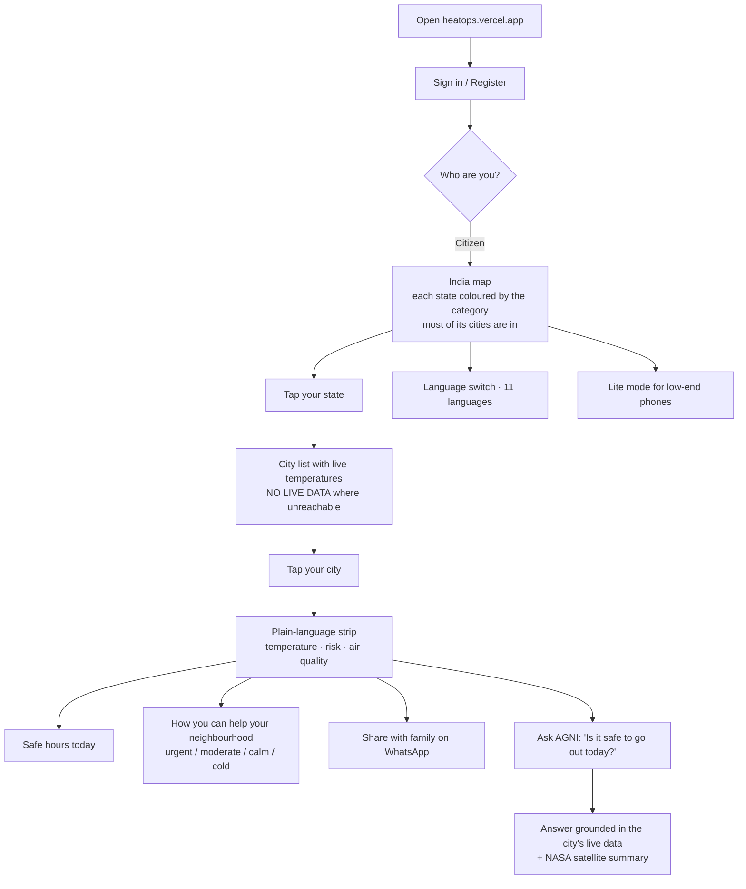
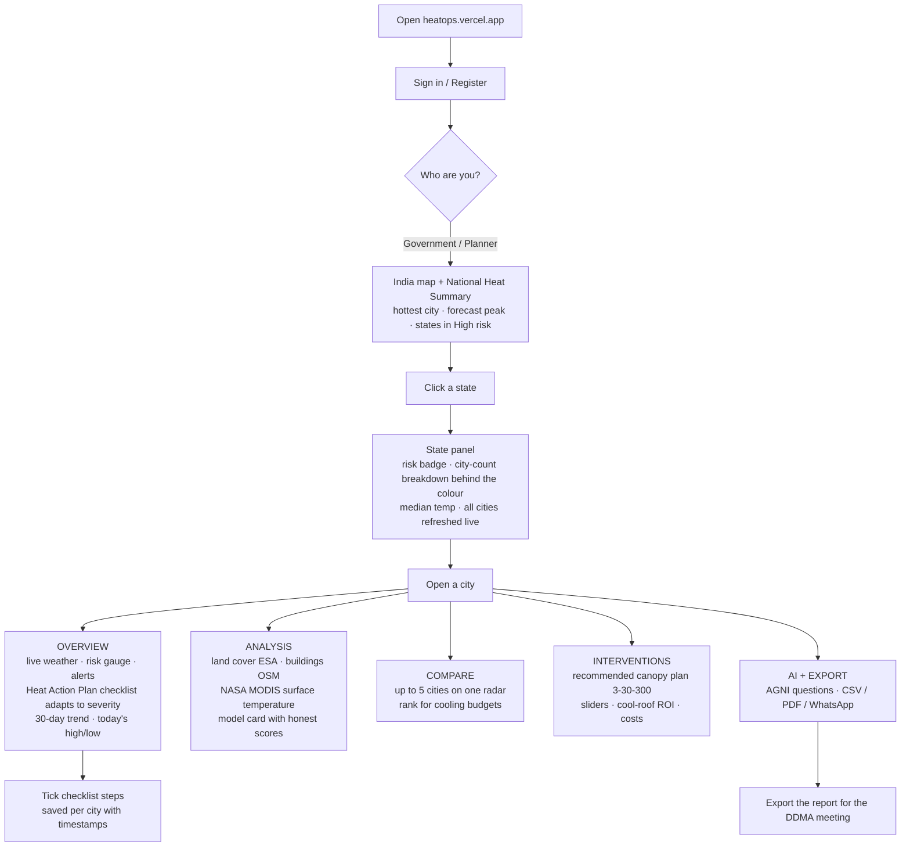
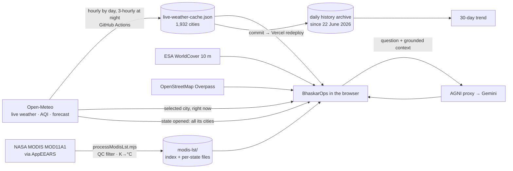

# BhaskarOps — Feature Map (small → large) and User Flows

*Matches the live product at https://heatops.vercel.app on 7 September 2026. Every item below exists and works today; anything illustrative or pending is marked as such.*

---

## 1. Small features — the details people notice second

| Feature | Where | What it does |
|---|---|---|
| "Updated X min ago" line | Map, every panel | Every number carries the age of its reading; nothing pretends to be fresher than it is |
| **NO LIVE DATA** badge | State city list, city panels | A city we could not reach says so — no estimate is ever substituted |
| **Carried forward** flag | Cache, hollow dots on charts | A reading the refresh could not renew keeps its original timestamp and is drawn hollow |
| Weather badges on the map | Map | One vector glyph per state where rain, dust or heavy cloud is active right now |
| State tooltip | Map hover | Median temperature, risk badge, the per-category city counts behind the colour, city count |
| Hover highlight | Map | The state under the cursor lightens with an outline so you know what you are pointing at |
| Legend | Map (button) | The six heat categories with their thresholds, same source as the map colours |
| Zoom + / − / reset | Map | Zoom stops at "fit" so India never drifts off-card |
| Quick Picks | Map screen | One-tap Delhi, Mumbai, Bengaluru, Jaipur, Chennai, Kolkata |
| Search any city | Map screen | 1,956 cities, state-disambiguated (which "Aurangabad" you mean) |
| Live clock in IST | Nav bar | Ticks every second without re-rendering the map |
| Ticker | Below nav | Hottest city, worst AQI, rainiest city, climate phase — all from the live cache |
| "peak 40°" tag | Hottest-cities list | Forecast high next to the current reading when the peak is still ahead |
| Source line under every metric | All panels | Open-Meteo, ESA, OSM, NASA, SRTM — named, with dates where they matter |
| "(estimated)" / "illustrative" labels | Baseline indices, intervention model | Anything not measured says so in the label itself |
| Mobile / Laptop toggle | Nav bar | Two layouts, remembered per browser; works at 375 px |
| Language switch | Nav bar | 11 languages: English, Hindi, Bengali, Tamil, Telugu, Marathi, Gujarati, Urdu, Kannada, Odia, Punjabi |
| Lite mode | Avatar menu | No blur, no animations, states-only map, static starfield — same data, for low-end phones |
| Demo override | URL `?demo=Leh:-8,Sri Ganganagar:46` | Forces a city's temperature for a rehearsal — with a visible "DEMO — not real data" banner |
| Panel icons | Everywhere | One consistent vector icon set (lucide), no emoji in the UI |

---

## 2. Medium features — the panels

### Map screen
| Feature | What it does |
|---|---|
| **Live India map** | 36 states/UTs, 594 districts. Each state is coloured by the **risk category most of its cities are in** (plurality vote over live readings; ties go to the more severe category). |
| **Today's National Heat Summary** | Hottest city right now, today's forecast peak city, states in Extreme/High, national average — all from the same live cache the map uses |
| **State panel** | Risk badge, the exact city-count breakdown behind the colour ("38 Moderate · 34 Low-Moderate…"), median temperature, baseline indices (labelled), AQI, and the full city list with live temperatures — refreshed live in one batched call when the state is opened |
| **Hottest cities list** | Top five nationally, colour-coded, with forecast peaks |

### City dashboard — Overview tab
| Feature | What it does |
|---|---|
| **Live weather card** | Temperature, feels-like, humidity, wind, cloud, sunrise/sunset, AQI with the US-EPA method note; each metric sourced |
| **Heat Risk Gauge** | Needle and arcs derived from the same six-bucket rule as the map |
| **Active alerts** | Threshold alerts from live values |
| **Heat Action Plan checklist** (Authority) | Severity-adaptive: full activation steps at High/Extreme (cooling centres, hospital alert, advisory, tankers, cool-roof priority), preparedness at Moderate, routine at Low, a cold-weather protocol below 10 °C. Ticks saved per city, timestamped. Modelled on the Ahmedabad HAP and NDMA guidelines |
| **Health & safety precautions** | Plain-language guidance matched to the current tier |
| **30-day temperature trend** | The platform's own daily archive; carried-forward days hollow, gaps left as gaps, live reading as a dashed line |
| **Today's high vs low** | The day's forecast maximum and minimum, from the same forecast as the weather card |
| **Elevation** | SRTM 30 m via Open-Meteo |

### City dashboard — Analysis tab
| Feature | What it does |
|---|---|
| **Data Pipeline — Real Sources** | The six real sources in order: Open-Meteo, ESA WorldCover, SRTM, NASA MODIS, Random Forest ML, the dashboard |
| **Land Use / Land Cover** | ESA WorldCover 10 m fractions (built-up, vegetation, water, bare) for a ~5 km sample around the city centre, with tree canopy |
| **Urban morphology** | Building count and density within 1 km from OpenStreetMap Overpass (live; says "unavailable" when Overpass is down) |
| **Satellite surface temperature (NASA MODIS)** | Latest clear-sky day and night surface temperature with date and overpass time, the season's hottest surface, season means, a weekly-average chart with the live air temperature as a reference line, and the caveat that surface ≠ air. 1,912 cities, every clear day since 1 March 2026 |
| **Random Forest model card** | The research prototype's honest scorecard: R² 0.95 on the test split and **−0.39 on unseen cities**, printed side by side; labelled "not the source of any number in this app" |
| **Heatmap grid** | An intervention-preview grid on the city's live temperature; the cell pattern is labelled illustrative |

### City dashboard — Compare tab
| Feature | What it does |
|---|---|
| **Compare cities** | Radar of live temperature, AQI, wind and land cover for up to five cities. Officials rank cities for cooling budgets; citizens ask "is my city hotter than my parents' city?" |

### City dashboard — Interventions tab
| Feature | What it does |
|---|---|
| **Recommended plan** | Tree canopy today (ESA) vs the 30 % target of the 3-30-300 rule, gap to close, cool-roof share, projected cooling — one click applies it to the sliders |
| **Intervention sliders** | Green cover, cool roofs, water bodies → projected cooling (an illustrative model, labelled) and cost estimates from Ahmedabad/Telangana pilot coefficients |
| **Cool roof comparison + ROI calculator** | Dark vs reflective roof physics, real adoption note (Telangana Cool Roof Policy 2023), payback estimate |

### City dashboard — AI + Export tab
| Feature | What it does |
|---|---|
| **AGNI** | The AI analyst (see §3) |
| **Export & share** | Copy summary, WhatsApp, CSV, PDF report |

### Citizen view
| Feature | What it does |
|---|---|
| **Plain-language strip** | "It is 34 °C and Moderate risk in Jaipur" — no acronyms |
| **Safe hours today** | When to go out, from the day's forecast curve |
| **How you can help your neighbourhood** | Tiered card: urgent / moderate / calm / cold, changes with the weather |
| **Share with family** | One-tap WhatsApp summary |
| **Ask AGNI** | Same analyst, simpler answers ("Audience: a resident") |

---

## 3. Large features — the systems underneath

| System | What it is |
|---|---|
| **Live data cache for 1,932 cities** | `public/live-weather-cache.json`: temperature, forecast high, rain chance, AQI, PM10, cloud, timestamp, carried-forward flag. Rebuilt by **GitHub Actions** every hour by day (06:30–19:30 IST) and every three hours at night; each run commits and redeploys. Connection failures retried; a run that cannot reach a city flags it instead of guessing |
| **Browser freshness loop** | The map reloads the cache every 15 minutes and on tab focus; it samples ~8 cities per state live only when the cache is older than 45 minutes; opening a state refreshes all of its cities in one call |
| **Daily history archive** | One snapshot per day since 22 June 2026 (`public/data/history/`), an API (`/api/weather-history`), a viewer page (`/history.html`) and CSV export — this feeds the 30-day trend |
| **NASA MODIS pipeline** | AppEEARS point samples → `scripts/processModisLst.mjs` (QC filter, Kelvin → °C, exact city matching) → one index + one file per state. Raw 70 MB CSVs stay out of git |
| **AGNI (Analytical Ground-level heat iNtelligence Interface)** | Gemini through a serverless proxy (key never in the browser); grounded on the selected city, any named cities, an India-wide ranking and the city's MODIS summary; India-only by design; "(estimated)" tagging; five-model fallback chain; 11 languages; conversation memory |
| **Map rendering** | react-simple-maps + d3 on mapshaper-simplified GeoJSON (5× fewer vertices, topology preserved), one shared projection, memoized layers; load-window script time cut 42 % in the 5 Sept pass |
| **Honesty rules, enforced in code** | No reading is fabricated; a missing reading says NO LIVE DATA; stale readings are flagged; illustrative models are labelled; the ML model prints its weak score; the demo override is banner-labelled; seeded "history" panels were removed rather than relabelled |
| **Refresh checklist + demo script** | `REFRESH_BEFORE_JUDGING.md` and `DEMO_SCRIPT.md`: what to check on the morning of judging and the 8-minute click path |

**Pending, shown honestly as pending:** NASA MODIS 2016–2026 for 171 cities (processing at NASA); ISRO INSAT-3D via MOSDAC (requested).

---

## 4. Flow charts

### Citizen journey

### Authority / Planner journey

### How the data moves

---

## 5. Where to read more

- `PROJECT_EXPLAINED.md` — how everything works and the dated change log (§8)
- `DEMO_SCRIPT.md` — the 8-minute click path for 9–10 September
- `REFRESH_BEFORE_JUDGING.md` — freshness checks on the morning
- `STAKEHOLDER_DIFFERENTIATION.md` — IMD / BHRIGU comparison
- `SIH_PITCH_CONTENT_SIMPLIFIED.md` — slide-by-slide content
