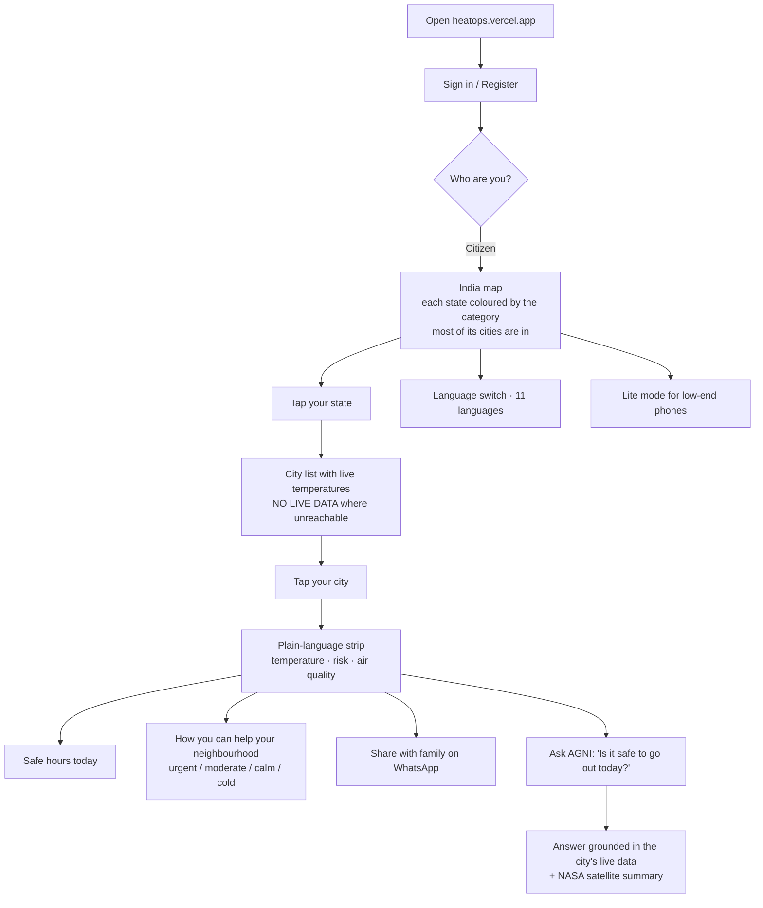
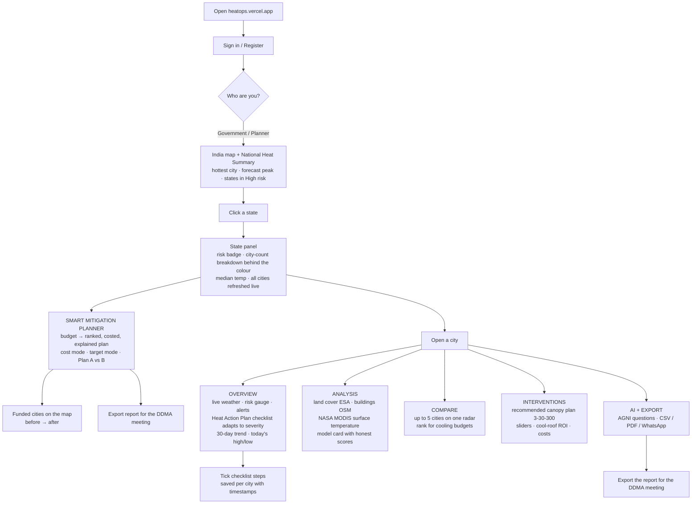
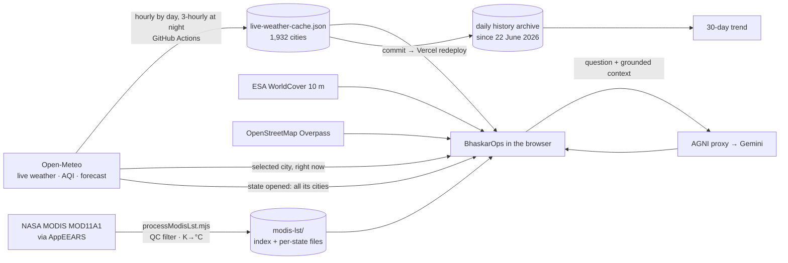

# BhaskarOps — The Story: From a Small Problem to a Large One

*The narrative version: the problem, the solution, what the app looks like screen by screen, what to say and what to click, and every feature from the smallest touch to the largest system. Facts match the live product at https://heatops.vercel.app on 8 September 2026. The short briefing and slide content are in `JUDGES_BRIEF.md`; the technical deep-dive is `PROJECT_EXPLAINED.md`.*

**Contents:** 1. The problem and the solution — what you say · 2. What you click — the 8-minute demo path · 3. Every feature, small to large, and the flow charts

---

## 1. The problem and the solution — what you say

*A spoken script, not a click list. Say it in your own words; the facts are exact as of 8 September 2026 and every one of them can be shown live at https://heatops.vercel.app. The click path with timings is in section 2; this section is what you say while you click.*

Speak slowly. Judges remember three things: the problem, the one thing only you do, and the moment you were honest about a limit.

---

### 1. Opening (30 seconds)

> "Good morning. I am [name], and this is BhaskarOps — Bhaskar for the sun, Ops because it is built for the officer who has to act.
>
> Every summer, heat kills more Indians than floods or cyclones, and most of those deaths are in cities. The India Meteorological Department already tells a district *how hot* it will be and *when*. What no one tells a District Magistrate is *where* in their district the heat is worst, *why* it is worst there, and *what to spend their limited budget on*.
>
> BhaskarOps answers those three questions, for 1,956 cities, live, and it never shows a number it cannot trace."

---

### 2. The problem, in the judges' language (45 seconds)

> "Three gaps.
>
> **First, granularity.** Warnings are issued per district. Heat is not felt per district. A tin-roof colony and a tree-lined cantonment in the same district are ten degrees apart on the ground.
>
> **Second, explanation.** A colour-coded alert says 'red'. It does not say 'red because 63 % of this city is built-up and its tree canopy is 17 % against a 30 % target'. Without the *why*, there is no *what to do*.
>
> **Third, money.** A District Magistrate gets a heat-mitigation budget and a list of possible measures — cool roofs, plantation, cooling centres. Nobody gives them a ranked, costed plan for their own district. So the money goes where the last meeting pointed."

---

### 3. The solution, in one breath (30 seconds)

> "BhaskarOps is a live urban-heat decision platform for government authorities. It fuses four real sources — Open-Meteo live weather, NASA MODIS satellite surface temperature, ESA WorldCover land cover, and OpenStreetMap — for every city in India, and it closes the loop: **monitor, explain, decide, act.**
>
> The one thing only we do: you type a budget, and it hands back a ranked, costed, explained mitigation plan for your state or your city — and every rupee in it is traceable to a printed assumption."

---

### 4. What the app looks like — walk-through (5 minutes)

Describe each screen as it appears. The words in bold are what is on screen.

#### 4a. Sign-in and the map (45 seconds)

*What they see:* a dark screen, a rotating Earth, a sign-in card. Then the India map: 28 states and 8 UTs, 594 districts, each state coloured green to red, small weather badges where it is raining or dusty, a ticker on top with the hottest city and worst air right now, and a **National Heat Summary** on the right.

> "This is the map as it is right now. Every state is coloured by the risk category *most of its cities are in*, from live readings — not an average that one desert town can drag. Hover a state and it tells you the count: 38 of 76 cities Moderate, 34 Low-Moderate. The colour rests on those numbers, and you can see them.
>
> On the right: the hottest city in India at this minute, today's forecast peak city, how many states are in High risk, and the national average. All from the same live cache, refreshed every hour by day."

#### 4b. A state, and the Smart Mitigation Planner (90 seconds) — the USP

*What they see:* click Rajasthan. The right column becomes the state panel: a risk badge, the city-count breakdown behind the colour, the median temperature, and the list of all 76 cities with live readings. Under the state name, an orange button: **SMART MITIGATION PLANNER — WHERE SHOULD THE MONEY GO?**

> "Imagine you are the state's heat officer. You have one crore rupees. Where does it go?"

*Click the button. A chip reads* **FOR THE STATE OFFICER / CMO — BUDGET ALLOCATION ACROSS CITIES.** *Click* **₹1 Cr** *then* **OPTIMIZE MY PLAN**.

> "In under a second: Bikaner, Jaipur, Jodhpur, Kota. Ranked on four real inputs — the forecast high, NASA's season-peak surface temperature for that city, ESA's built-up share, and the tree-canopy gap. The budget is spent where each rupee removes the most projected risk: plantation and cooling relief here, ₹99.6 lakh allocated, the ten highest-risk cities move from 78 to 76 on our composite score.
>
> Two things I want you to notice. The **Why this plan?** box explains the choice in sentences — a finance officer can argue with it. And the word **projected** is on every outcome, with a confidence tag."

*Click* **VIEW ON MAP** *— four markers appear with before → after. Click one.*

> "Each funded city opens with its inputs and its packages: so many roofs, so many hectares, a cooling centre."

*Click* **SAVE AS PLAN A**, *then* **₹50 L**.

> "Change the budget and it re-optimises live — Plan A against the current plan, side by side. This is not a page of numbers. It is a constraint solver."

*Click* **COST ASSUMPTIONS & METHOD**.

> "Every unit cost is printed. The cool-roof rate comes from the Ahmedabad 2017 pilot tier. The rest are stated assumptions a state can replace with its schedule of rates. And one line you will not see in most prototypes: **population is not modelled**, because we do not have a verified per-city table — so the plan reports roofs, hectares and facilities, not a population figure we made up."

#### 4c. A city dashboard — Overview (45 seconds)

*What they see:* search Jaipur, open it. Five tabs: OVERVIEW, ANALYSIS, COMPARE, INTERVENTIONS, AI + EXPORT. Overview shows the live weather card with a source under every metric, a Heat Risk Gauge, active alerts, the **Heatwave Action Checklist**, a **30-day temperature trend**, and **Today's high vs low**.

> "For the District Magistrate. Live weather with the source under each number. The Heat Action Plan checklist changes with severity: full activation at High or Extreme — cooling centres, hospital alert, advisory, tankers — preparedness at Moderate, routine at Low, and a cold-weather protocol below 10 °C. Ticks are saved per city with timestamps.
>
> The 30-day trend is our own archive, one real reading a day since June. Where we could not reach a city that day, the dot is hollow. Nothing is interpolated."

#### 4d. Analysis — the satellite (45 seconds)

*What they see:* the ANALYSIS tab. A pipeline list of six real sources, ESA land cover bars, OpenStreetMap building density, and the **SATELLITE SURFACE TEMPERATURE (NASA MODIS)** panel with four cards and a weekly chart.

> "This is what NASA's Terra satellite saw on Jaipur's roofs and roads at 10:30 every clear morning since March — hottest surface 40.3 °C on 28 May. The gaps in the chart are cloud days, left empty. The dashed line is the live air temperature, because surface and air are different measurements and we show both without pretending they are the same. 1,912 cities have this."

#### 4e. Interventions — the DM's planner and the sliders (45 seconds)

*What they see:* the INTERVENTIONS tab. At the top of the right column, **MITIGATION PLANNER — JAIPUR** with the chip **FOR THE DISTRICT MAGISTRATE — BUDGET ALLOCATION WITHIN THIS CITY**. On the left, three sliders — Urban Greening, Cool Roofs, Water Bodies — and a cool-roof comparison with the ROI calculator.

> "The same engine, now for one city. One crore in Jaipur buys this. Press **APPLY PLAN TO SLIDERS** and the cooling sliders take the plan's values — the projected cooling and the heat grid on the Analysis tab follow. Data to decision to action, on one screen."

#### 4f. AGNI and export (30 seconds)

*What they see:* the AI + EXPORT tab. A chat box. Ask: **"What did the NASA satellite measure for Jaipur this season?"**

> "AGNI is our analyst — Gemini behind a proxy, grounded only on our data: this city, any city you name, an India-wide ranking, and the satellite summary. Ask it about the world and it refuses, because it only has India."

*The answer names 40.3 °C on 28 May.* *Then* **EXPORT** *— CSV, PDF, WhatsApp.*

#### 4g. Citizen view — one breath (15 seconds)

*Click* **Citizen** *in the nav bar, then back.*

> "The same data in plain language for residents — safe hours, a WhatsApp share, eleven languages. It exists; the product is built for the authority."

---

### 5. Honesty — say it out loud (30 seconds)

> "We removed more than we added this week. Panels that generated 'history' from a city-name hash are gone. Where a city has no reading, it says NO LIVE DATA. Our machine-learning model prints its weak score, −0.39 on unseen cities, next to its good one. The demo override that forces a temperature shows a banner that says it is a demo. A judge who checks any number will find its source — or a label saying it is an estimate."

---

### 6. Close (20 seconds)

> "IMD tells you how hot and when. BHRIGU gives you twenty years of evidence. BhaskarOps tells the officer *where*, *why*, and *what to spend on* — today, for 1,956 cities, at zero rupees a month, and it never fakes a number.
>
> BhaskarOps: live heat intelligence for India, honest by design. Thank you."

---

---

## 2. What you click — the 8-minute demo path

Open **https://heatops.vercel.app/?demo=Leh:-8,Sri%20Ganganagar:46** before you start (hard-refresh once). Sign in — it lands on the **Government / Planner** view. Keep phone hotspot ready as backup network. Timings are targets; the total is ~8 minutes.

### 0:00 — Opening line (map screen)
> "Every number on this screen can be clicked and traced to its source. IMD tells you how hot and when; BhaskarOps tells you *why*, *where*, and *what to do* — for 1,932 Indian cities, live."

Point at: the map colours ("each state shows the category most of its cities are in right now — hover and it tells you the count, e.g. 38 of 76 cities Moderate"), a weather badge, the "updated X min ago" line, and in the National Summary the hottest-cities list with its **"peak 40°"** tags and the **Today's forecast high** card ("now vs expected — both from the forecast, neither invented").

### 0:45 — The map is live, not a picture
Click **Rajasthan**. Say: "Opening a state reads all its cities live in one call — see the green dots." Hover the state tooltip: the per-category city counts behind the colour, and the median temperature as the headline number. Scroll the city list: "no number here is estimated — a city we can't reach says NO LIVE DATA."

### 1:30 — City dashboard (Sri Ganganagar → forced 46 °C by the demo link)
Search **Sri Ganganagar** → Overview. The banner says "DEMO — forced to 46 °C, not real data". Say it out loud: *"Our demo mode is labelled, because our product never fakes a reading — even for a demo."* Show: the red theme, the Heat Risk Gauge, the live weather card with sources under each metric. Scroll to **30-DAY TEMPERATURE TREND** — "this is our own archive, one real reading a day since June; hollow dots are days we could not reach the city and say so" — and **TODAY'S HIGH vs LOW** from the forecast.

### 2:30 — The action layer (Authority)
Scroll to **HEATWAVE ACTION CHECKLIST** — "ACTIVE — Extreme". "Five Heat Action Plan steps, modelled on Ahmedabad's HAP and NDMA guidelines. Tick one." Then: "At Moderate it becomes preparedness; at Low, routine; below 10 °C it becomes a cold-weather protocol." *(Optional: search Leh → −8 °C → cold checklist, 20 seconds.)*

### 3:30 — The decision engine: Smart Mitigation Planner (the USP)
Back on the map, open **Rajasthan** → press **SMART MITIGATION PLANNER — WHERE SHOULD THE MONEY GO?**
> "Imagine you are the District Magistrate. You have ₹1 crore for heat mitigation. Where does it go?"

Click **₹1 Cr** → **OPTIMIZE MY PLAN**. Read out: "Bikaner, Jaipur, Jodhpur, Kota — ranked on the forecast high, NASA's season-peak surface temperature, ESA built-up share and the canopy gap. Plantation and cooling relief, ₹99.6 L allocated, the ten highest-risk cities move from 78 to 76 — projected, labelled, with a confidence tag." Point at **WHY THIS PLAN?** — "the reasons are sentences, not a black box."
Click **VIEW ON MAP** — four markers appear with before → after. Click one: "the city's inputs and its packages."
Click **SAVE AS PLAN A**, then **₹50 L**: "it re-optimises in real time — Plan A versus current, side by side. This is not a static page; it is a constraint solver."
Open **COST ASSUMPTIONS & METHOD**: "every unit cost is printed — the cool-roof rate comes from the Ahmedabad 2017 pilot tier; the rest are stated assumptions a finance officer can replace. Population is not modelled because we have no verified table, and it says so." **EXPORT REPORT** → the text report for the DDMA meeting.

### 5:15 — Why it's hot + what to do (fast)
**Analysis** tab: scroll to **SATELLITE SURFACE TEMPERATURE (NASA MODIS)** — "this is what Terra saw on Delhi's roofs and roads at 10:30 every clear morning since March: hottest surface 39.9 °C on 20 May, and the gaps are honest — cloud days are left empty, not filled in." Then the heatmap grid — "base is the live temperature; the cell pattern is labelled illustrative."
**Interventions** tab: first the **MITIGATION PLANNER — SRI GANGANAGAR** box — "the same engine, now scoped to this one city for its DM: ₹1 crore here buys this, and this is what it projects" (one click on ₹1 Cr → OPTIMIZE). Then **Recommended plan** — "Tree canopy 9.7 % vs the 30 % target of the 3-30-300 rule; +20 points; Apply." Click **Apply recommended plan** → projected cooling appears. "The cooling model is illustrative and says so; the canopy number is ESA satellite data."

### 6:00 — Compare
**Compare** tab: add Jaipur, Bikaner. "Same chart, two jobs — a collector ranks cities for cooling budgets; a citizen asks *is my city hotter than my parents' city?*"

### 6:30 — AGNI (one pre-tested question)
Floating AGNI button → ask exactly: **"Which Indian city has the best AQI right now?"** Say: "Grounded on our own cache — it will name real cities, and if you ask it about the world it refuses, because it only has India." *(Have the answer screenshot ready in case of quota/network.)*

### 7:00 — Citizen view (thirty seconds, not more)
Switch **Citizen** (navbar) for one breath: "the same data in plain language for residents — safe hours, a WhatsApp share, 11 languages". Switch back. The pitch stays with the authority.

### 7:30 — Data credibility + close
**AI + Export** tab → Export & Share (Copy / WhatsApp / CSV / PDF). Then the honesty line:
> "Every source is named — Open-Meteo, ESA WorldCover, NASA MODIS satellite surface temperature for 1,912 cities, ISRO INSAT-3D requested. Our ML model prints its weak score next to its good one. It refreshes itself every three hours from GitHub. Running cost: zero rupees."

> "BhaskarOps: live heat intelligence for India — honest by design, useful to a citizen and a collector alike."

### If things go wrong
- **Network dead:** open the recorded screen video / screenshots folder; narrate the same script.
- **AGNI busy:** say "free-tier quota — here's the answer from an hour ago" and show the screenshot; move on.
- **Banner confusion:** "That banner is our demo mode — remove `?demo` and every number is live." Show it live on Jaipur.
- **"Isn't this just IMD/BHRIGU?"** — "We complement both: IMD alerts, BHRIGU's archive, our live action layer."

### Pre-demo checklist (morning of)
- `REFRESH_BEFORE_JUDGING.md` freshness check (cache < 3 h old, carried-forward small)
- Hard-refresh the demo tab; sign-in works; demo link loads; AGNI question answered once; planner: Rajasthan → ₹1 Cr → OPTIMIZE gives a plan (if a city has no live reading it is listed as unranked — that is fine)
- Laptop charged; hotspot on; video + screenshots on the desktop; this script printed

---

---

## 3. Every feature, small to large, and the flow charts

*Matches the live product at https://heatops.vercel.app on 7 September 2026. Every item below exists and works today; anything illustrative or pending is marked as such.*

---

### 1. Small features — the details people notice second

| Feature | Where | What it does |
|---|---|---|
| "Updated X min ago" line | Map, every panel | Every number carries the age of its reading; nothing pretends to be fresher than it is |
| **NO LIVE DATA** badge | State city list, city panels | A city we could not reach says so — no estimate is ever substituted |
| **Carried forward** flag | Cache, hollow dots on charts | A reading the refresh could not renew keeps its original timestamp and is drawn hollow |
| Weather badges on the map | Map | One vector glyph per state where rain, dust or heavy cloud is active right now |
| State tooltip | Map hover | Median temperature, risk badge, the per-category city counts behind the colour, city count |
| Hover highlight | Map | The state under the cursor lightens with an outline so you know what you are pointing at |
| Legend | Map (button) | The six heat categories with their thresholds, same source as the map colours |
| Zoom + / − / reset | Map | Zoom stops at "fit" so India never drifts off-card |
| Quick Picks | Map screen | One-tap Delhi, Mumbai, Bengaluru, Jaipur, Chennai, Kolkata |
| Search any city | Map screen | 1,956 cities, state-disambiguated (which "Aurangabad" you mean) |
| Live clock in IST | Nav bar | Ticks every second without re-rendering the map |
| Ticker | Below nav | Hottest city, worst AQI, rainiest city, climate phase — all from the live cache |
| "peak 40°" tag | Hottest-cities list | Forecast high next to the current reading when the peak is still ahead |
| Source line under every metric | All panels | Open-Meteo, ESA, OSM, NASA, SRTM — named, with dates where they matter |
| "(estimated)" / "illustrative" labels | Baseline indices, intervention model | Anything not measured says so in the label itself |
| Mobile / Laptop toggle | Nav bar | Two layouts, remembered per browser; works at 375 px |
| Language switch | Nav bar | 11 languages: English, Hindi, Bengali, Tamil, Telugu, Marathi, Gujarati, Urdu, Kannada, Odia, Punjabi |
| Lite mode | Avatar menu | No blur, no animations, states-only map, static starfield — same data, for low-end phones |
| Demo override | URL `?demo=Leh:-8,Sri Ganganagar:46` | Forces a city's temperature for a rehearsal — with a visible "DEMO — not real data" banner |
| Panel icons | Everywhere | One consistent vector icon set (lucide), no emoji in the UI |

---

### 2. Medium features — the panels

#### Map screen
| Feature | What it does |
|---|---|
| **Live India map** | 28 states and 8 UTs, 594 districts. Each state is coloured by the **risk category most of its cities are in** (plurality vote over live readings; ties go to the more severe category). |
| **Today's National Heat Summary** | Hottest city right now, today's forecast peak city, states in Extreme/High, national average — all from the same live cache the map uses |
| **State panel** | Risk badge, the exact city-count breakdown behind the colour ("38 Moderate · 34 Low-Moderate…"), median temperature, baseline indices (labelled), AQI, and the full city list with live temperatures — refreshed live in one batched call when the state is opened |
| **Hottest cities list** | Top five nationally, colour-coded, with forecast peaks |

#### City dashboard — Overview tab
| Feature | What it does |
|---|---|
| **Live weather card** | Temperature, feels-like, humidity, wind, cloud, sunrise/sunset, AQI with the US-EPA method note; each metric sourced |
| **Heat Risk Gauge** | Needle and arcs derived from the same six-bucket rule as the map |
| **Active alerts** | Threshold alerts from live values |
| **Heat Action Plan checklist** (Authority) | Severity-adaptive: full activation steps at High/Extreme (cooling centres, hospital alert, advisory, tankers, cool-roof priority), preparedness at Moderate, routine at Low, a cold-weather protocol below 10 °C. Ticks saved per city, timestamped. Modelled on the Ahmedabad HAP and NDMA guidelines |
| **Health & safety precautions** | Plain-language guidance matched to the current tier |
| **7-day heatwave outlook** | Forecast maxima classified with IMD thresholds (plains/coast/hills), spells of consecutive qualifying days, headline badge; on the Interventions tab it shows "if nothing is done" vs "with the plan" |
| **30-day temperature trend** | The platform's own daily archive; carried-forward days hollow, gaps left as gaps, live reading as a dashed line |
| **Today's high vs low** | The day's forecast maximum and minimum, from the same forecast as the weather card |
| **Elevation** | SRTM 30 m via Open-Meteo |

#### City dashboard — Analysis tab
| Feature | What it does |
|---|---|
| **Data Pipeline — Real Sources** | The six real sources in order: Open-Meteo, ESA WorldCover, SRTM, NASA MODIS, Random Forest ML, the dashboard |
| **Land Use / Land Cover** | ESA WorldCover 10 m fractions (built-up, vegetation, water, bare) for a ~5 km sample around the city centre, with tree canopy |
| **Urban morphology** | Building count and density within 1 km from OpenStreetMap Overpass (live; says "unavailable" when Overpass is down) |
| **Satellite surface temperature (NASA MODIS)** | Latest clear-sky day and night surface temperature with date and overpass time, the season's hottest surface, season means, a weekly-average chart with the live air temperature as a reference line, and the caveat that surface ≠ air. 1,912 cities, every clear day since 1 March 2026 |
| **Random Forest model card** | The research prototype's honest scorecard: R² 0.95 on the test split and **−0.39 on unseen cities**, printed side by side; labelled "not the source of any number in this app" |
| **Heatmap grid** | An intervention-preview grid on the city's live temperature; the cell pattern is labelled illustrative |

#### City dashboard — Compare tab
| Feature | What it does |
|---|---|
| **Compare cities** | Radar of live temperature, AQI, wind and land cover for up to five cities. Officials rank cities for cooling budgets; citizens ask "is my city hotter than my parents' city?" |

#### City dashboard — Interventions tab
| Feature | What it does |
|---|---|
| **Recommended plan** | Tree canopy today (ESA) vs the 30 % target of the 3-30-300 rule, gap to close, cool-roof share, projected cooling — one click applies it to the sliders |
| **Intervention sliders** | Green cover, cool roofs, water bodies → projected cooling (an illustrative model, labelled) and cost estimates from Ahmedabad/Telangana pilot coefficients |
| **Cool roof comparison + ROI calculator** | Dark vs reflective roof physics, real adoption note (Telangana Cool Roof Policy 2023), payback estimate |

#### City dashboard — AI + Export tab
| Feature | What it does |
|---|---|
| **AGNI** | The AI analyst (see §3) |
| **Export & share** | Copy summary, WhatsApp, CSV, PDF report |

#### Citizen view
| Feature | What it does |
|---|---|
| **Plain-language strip** | "It is 34 °C and Moderate risk in Jaipur" — no acronyms |
| **Safe hours today** | When to go out, from the day's forecast curve |
| **How you can help your neighbourhood** | Tiered card: urgent / moderate / calm / cold, changes with the weather |
| **Share with family** | One-tap WhatsApp summary |
| **Ask AGNI** | Same analyst, simpler answers ("Audience: a resident") |

---

### 3. Large features — the systems underneath

| System | What it is |
|---|---|
| **Live data cache for 1,932 cities** | `public/live-weather-cache.json`: temperature, forecast high, rain chance, AQI, PM10, cloud, timestamp, carried-forward flag. Rebuilt by **GitHub Actions** every hour by day (06:30–19:30 IST) and every three hours at night; each run commits and redeploys. Connection failures retried; a run that cannot reach a city flags it instead of guessing |
| **Browser freshness loop** | The map reloads the cache every 15 minutes and on tab focus; it samples ~8 cities per state live only when the cache is older than 45 minutes; opening a state refreshes all of its cities in one call |
| **Daily history archive** | One snapshot per day since 22 June 2026 (`public/data/history/`), an API (`/api/weather-history`), a viewer page (`/history.html`) and CSV export — this feeds the 30-day trend |
| **NASA MODIS pipeline** | AppEEARS point samples → `scripts/processModisLst.mjs` (QC filter, Kelvin → °C, exact city matching) → one index + one file per state. Raw 70 MB CSVs stay out of git |
| **AGNI (Analytical Ground-level heat iNtelligence Interface)** | Gemini through a serverless proxy (key never in the browser); grounded on the selected city, any named cities, an India-wide ranking and the city's MODIS summary; India-only by design; "(estimated)" tagging; five-model fallback chain; 11 languages; conversation memory |
| **Map rendering** | react-simple-maps + d3 on mapshaper-simplified GeoJSON (5× fewer vertices, topology preserved), one shared projection, memoized layers; load-window script time cut 42 % in the 5 Sept pass |
| **Honesty rules, enforced in code** | No reading is fabricated; a missing reading says NO LIVE DATA; stale readings are flagged; illustrative models are labelled; the ML model prints its weak score; the demo override is banner-labelled; seeded "history" panels were removed rather than relabelled |
| **Smart Mitigation Planner** | The decision engine for "I have ₹X — where should it go?": ranks a state's cities on live, satellite and land-cover data, spends the budget greedily by projected risk-points per rupee across procurable packages, explains itself in sentences, shows before/after, funded cities on the map, Plan A vs current, cost mode, target mode, and a government-style export with assumptions and limitations. Every unit cost is a stated assumption; population is declared not modelled |
| **Refresh checklist + demo script** | `REFRESH_BEFORE_JUDGING.md` and `DEMO_SCRIPT.md`: what to check on the morning of judging and the 8-minute click path |

**Pending, shown honestly as pending:** NASA MODIS 2016–2026 for 171 cities (in the app); ISRO INSAT-3D via MOSDAC (requested).

---

### 4. Flow charts

#### Citizen journey

#### Authority / Planner journey

#### How the data moves

---

### Where to read more

- `PROJECT_EXPLAINED.md` — how everything works and the dated change log (§8)
- `REFRESH_BEFORE_JUDGING.md` — freshness checks on the morning

---
