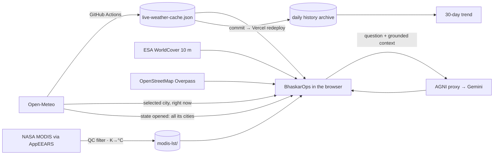

# BhaskarOps — SIH 2026 PPT Master Content

**One file, every fact, ready to lift into slides.**
Consolidated on 7 September 2026 from all project markdown (SIH_IDEA_SUBMISSION, SIH_PITCH_CONTENT_SIMPLIFIED, HEATOPS_PPT_CONTENT, STAKEHOLDER_DIFFERENTIATION, FEATURES, PROJECT_EXPLAINED, DEMO_SCRIPT, REFRESH_BEFORE_JUDGING, architecture, prd, design, phases, memory, PHASE1/PHASE2 historical docs). Numbers were re-verified against the repo data files on 7 Sept 2026 where they differed between documents.

- **Live prototype:** https://heatops.vercel.app
- **Source:** https://github.com/kkrrishagarwal/heatops
- **Demo link (cold + extreme tiers in one session):** https://heatops.vercel.app/?demo=Leh:-8,Sri%20Ganganagar:46
- **Rendered submission deck:** `BhaskarOps_SIH2026_Idea_Submission.pdf` (6 pages, 16:9) — source `docs/sih_submission.html`, rebuild with `node scripts/renderSubmissionPdf.mjs` (see §28)

---

## 0. How to use this file

| Section | Use it for |
|---|---|
| §1 Identity | Title slide, tagline, naming rationale |
| §2 Key numbers | Any "by the numbers" slide, stat tiles |
| §3 Problem | Problem statement slide |
| §4–§5 Solution + USP | Proposed solution, innovation slides |
| §6 Features | Feature grid, demo thumbnails |
| §7 Audiences + journeys | Citizen / Authority slides, user-flow diagrams |
| §8 Pipeline | Six-step process flow |
| §9 AGNI | AI slide |
| §10 Honesty | Trust / credibility slide |
| §11 Data sources | Data slide, logo row |
| §12–§14 Tech, architecture, refresh | Technical approach slides |
| §15 ML disclosure | Model slide |
| §16 Comparison | "How we differ" vs IMD / BHRIGU |
| §17 Impact | Impact and benefits |
| §18–§19 Feasibility, cost | Feasibility and viability |
| §20 Phases + roadmap | Timeline slide |
| §21 Design | Visual identity notes for the designer |
| §22 Engineering proof | "We measured it" slide |
| §23 Demo | Speaker notes, fallback plan |
| §24 Evaluation mapping | Judge-criteria slide |
| §25 Submission text | Portal form fields |
| §26 References | Last slide |
| §27 Suggested deck order | Slide sequence |
| §28 Submission PDF | The rendered deck, what is on each page, how to rebuild it |

---

## 1. Identity

- **Product name:** BhaskarOps
- **AI persona:** AGNI
- **Idea title (one line):** BhaskarOps — India's Urban Heat Island monitoring and intervention platform, with AGNI, an AI heat analyst grounded in real data
- **Tagline (short):** Live heat intelligence for India — honest by design, useful to a citizen and a collector alike.
- **Tagline (alt):** Live monitoring for 1,932 Indian cities. Plain-language guidance for citizens. Action playbooks for officials.
- **Closing paragraph (last page of the PDF):** Existing tools tell you where it is hot. BhaskarOps tells you why, what to do about it and roughly what it costs — and labels every number it cannot measure. That last part is not a feature anyone can copy; it is a discipline, and our commit history is the proof.
- **Problem in one line:** Indian cities are getting hotter, the data to act already exists, but it sits in silos nobody can use in time.
- **USP in one line:** "A heat dashboard you can show a judge, a planner, or a citizen — and every number survives the question 'where's that from?'"
- **Positioning:** An actionable, real-data, India-first heat intelligence platform that blends monitoring, comparison, planning and plain-language AI explanation into one experience.
- **North star:** Help people understand the *why* behind urban heat and turn that understanding into practical mitigation decisions.
- **PS Category:** Software. **Hardware required:** none.

### Title-slide fields (fill in)
- Problem Statement ID: [enter]
- Problem Statement Title: [enter]
- Theme: [Climate / Environment / Disaster Management — pick the one on the portal]
- Team ID: [enter]
- Team Name: [enter]

### Naming rationale
**BhaskarOps**
- *Bhaskar* (भास्कर) = the Sun in Sanskrit/Hindi — the literal source of the heat the platform measures, models and mitigates.
- Backronym: **B**harat **H**eat **A**nalysis, **S**urveillance, **K**nowledge & **A**ssessment **R**esource.
- *Ops* = Optimization & Planning System — deliberately not "Dashboard" or "Monitor". The intervention sliders, ROI templates and action checklists exist so a planner can act, not just observe.

**AGNI**
- *Agni* (अग्नि) = Fire — Bhaskar names the heat's source, Agni names its intensity and danger, which is what the analyst interprets.
- Backronym: **A**nalytical **G**round-level heat i**N**telligence **I**nterface.
- Recognisable to Indian users (missile programme), lending precision and credibility.
- Sun + Fire: one coherent, culturally grounded identity, not two invented names.

---

## 2. Key numbers (verified 7 Sept 2026)

| Metric | Value |
|---|---|
| Cities covered | 1,956 across all **28 states and 8 UTs** (36 total) |
| Cities with live readings | 1,932 (rest say "NO LIVE DATA", never a guess) |
| Cities left honestly blank (unresolvable hamlet/colony names) | 24 |
| Districts on the map | 594 districts + 35 state/UT boundaries (real GeoJSON) |
| Languages | 11 (English, Hindi, Bengali, Tamil, Telugu, Marathi, Gujarati, Urdu, Kannada, Odia, Punjabi) |
| Translation keys | 278 covering every label, placeholder, status, button |
| Daily history archive | 72 daily snapshots, 22 June → 7 Sept 2026, growing every run |
| Refresh cadence | Hourly through the Indian day (08:30–19:30 IST), every 3 hours overnight, via GitHub Actions; Vercel Cron fallback at 14:30 IST + 16:00 IST retry |
| Carried-forward cities on latest run | 0 of 1,932 |
| NASA MODIS satellite surface temperature | 1,912 cities, every clear-sky day since 1 March 2026; 170,052 quality-passed readings |
| ESA WorldCover land cover (incl. tree canopy) | 171 cities classified at 10 m; others borrow the nearest classified city, labelled with distance |
| Geocoding audit | 202 cities were pointing at the wrong place, 267 unresolved; now 1,932 validated to lie in their own state |
| ML model scores | R² 0.95 on validation split, R² −0.39 on unseen cities — both printed in-app |
| AGNI structured templates | 7 |
| AGNI model fallback chain | 5 Gemini models |
| AGNI conversation memory | last 10 turns |
| AGNI rate limit | 10 questions/minute/user |
| Heat tiers on the map | 6 (Low <25 · Low-Moderate 25–30 · Moderate 30–35 · High 35–40 · Very High 40–45 · Extreme 45+ °C) |
| Canopy target used | 30 % (the "30" of the 3-30-300 urban-forestry rule) |
| Map load script time cut (5 Sept pass) | 3,920 ms → 2,297 ms (42 %) |
| Cursor-lag fix (profiled) | 69.5 s → 15.9 s in the same 15 s cursor test |
| Running cost today | ₹0 / month (free tiers) |
| Works down to | 375 px width; Lite mode for 2G / Save-Data phones |

---

## 3. The problem

### Short version
Indian cities are experiencing intensifying Urban Heat Islands (UHI): built-up, low-vegetation zones running several degrees hotter than their surroundings, worsening heatwaves, energy demand and health risk. The data to act (satellite land cover, weather, air quality) already exists but sits in silos nobody can use in time.

### Who is hurt most
Outdoor workers, daily-wage earners, the elderly, and low-income households without reliable cooling. Stopping outdoor work means lost income; district-level alerts miss the hotter micro-areas (tin-roof bastis, treeless colonies).

### Four gaps today
1. **Citizens** have no simple way to see *why* their city is hot, only that it is.
2. **Planners and municipal officials** cannot compare cities or simulate which cooling intervention (green cover, reflective roofs, water bodies) would work for their city before committing budget.
3. **Existing dashboards are English-only**, excluding non-English-speaking municipal staff and citizens — the people who most need to act.
4. **Most heat tools are static viewers**: they show the problem but give no path to action, and many hackathon-style projects use simulated numbers that collapse under scrutiny.

### Scope choice
The mechanism plays out nationwide, so BhaskarOps deliberately covers all 28 states and 8 UTs and their districts, including rural areas, not a single metro.

---

## 4. The solution — what BhaskarOps does

- Interactive India map, each state coloured by the risk category most of its cities are in right now (plurality over live readings; ties go to the more severe category), drill-down to 594 districts.
- 1,956 cities across all 28 states and 8 UTs; 1,932 with live readings.
- City dashboard with five tabs: **Overview** (live weather/AQI, 30-day trend, today's high/low) · **Analysis** (satellite indices, land cover, NASA MODIS surface temperature, ML card) · **Compare** (radar vs up to 4 other cities) · **Interventions** (cooling sliders → projected °C, recommended canopy plan, cool-roof ROI) · **AI + Export** (AGNI, PDF/CSV/WhatsApp).
- Two audiences, one product: **Citizen view** (plain-language risk badge, safe hours today, WhatsApp share, how to help the neighbourhood) and **Authority view** (full dashboard + severity-adaptive Heatwave Action Checklist).
- AGNI: ask questions in plain language in any of 11 Indian languages, answered from the same data the map shows.
- Self-refreshing: the platform re-fetches all cities on a schedule, commits the data to GitHub and redeploys itself; a daily history archive grows on its own.

### How it addresses the problem
- The data already exists but is siloed; BhaskarOps fuses it into one tool anyone can open.
- Closes the loop: **monitor → compare → simulate intervention → communicate** (AGNI explains, Export shares).
- Reaches the people who act: residents, ward officers, planners, non-technical decision-makers.

### Three users, three reasons to use it
- **Citizens:** an accessible, multilingual, real-data view of how hot their city is and why, with safe hours, a share button and concrete neighbourhood actions.
- **Planners / municipal officials:** the Authority view — Heatwave Action Checklist, weather overlays, historic data for evidence — plus Compare and Interventions to benchmark and simulate before spending.
- **Decision-makers without technical background:** AGNI — ask "why is this city hot?" and get a grounded answer, a structured heatwave warning, vulnerability score or ROI breakdown.

---

## 5. Innovation and uniqueness (USP)

1. **Radical honesty in code:** every number is traceable to a named source; gaps say "NO LIVE DATA"; stale values are flagged "carried forward"; AI figures without live data are tagged "(estimated)"; the ML model prints its weak score next to its good one.
2. **AGNI, India-only by design:** answers ranking questions from a real 1,932-city cache, refuses global claims, remembers the conversation, replies in 11 languages, key never reaches the browser.
3. **Intervention simulator + Recommended plan + Cool Roof ROI**, not just a viewer: each city's tree canopy (ESA WorldCover) vs the 30 % target of the 3-30-300 rule, one click to apply.
4. **Self-refreshing:** GitHub Actions re-fetches all cities hourly by day, commits the data and redeploys; 72 days of daily history already kept.
5. **Two audiences, one shared picture:** Citizen and Authority views on the same live data.
6. **Full national coverage:** 1,956 cities, 28 states and 8 UTs — not a single-city demo.
7. **Built for India's linguistic diversity:** 11 languages, not English-only.

### Stated honestly as pending, not claimed as built
| Item | Status as shown in the product |
|---|---|
| **NASA MODIS 2016–2026 series** (171 cities, decade-long history) | **Delivered 9 Sept and in the app** — year-by-year peak-season chart. Until it lands, the app shows only what it has: every clear-sky day since 1 March 2026 |
| **ISRO INSAT-3D LST** via MOSDAC | Pipeline written, **access requested**. Named on the roadmap, never on a data panel |
| **Retraining on Indian cities** | Planned once the decade series lands — which is exactly why the model's **−0.39** unseen-city score is published today |

### The two traps most heat dashboards fall into
- **Pure visualisation, no real data** — pretty maps with simulated numbers that fall apart the moment someone asks "where does this number come from?"
- **Real data, but a dead-end viewer** — shows the problem, gives no path to action.

BhaskarOps is built to avoid both.

---

## 6. Feature inventory

### 6.1 Small features (the details people notice second)
| Feature | What it does |
|---|---|
| "Updated X min ago" line | Every number carries the age of its reading |
| NO LIVE DATA badge | A city we could not reach says so; no estimate substituted |
| Carried-forward flag | Un-renewed readings keep their original timestamp, drawn hollow on charts |
| Weather badges on the map | One vector glyph per state where rain (≥ 60 %), dust (PM10 ≥ 400) or heavy cloud (≥ 80 %) is active |
| State tooltip | Median temperature, risk badge, per-category city counts behind the colour |
| Legend | Six heat categories with thresholds, same source as the map colours |
| Zoom + / − / reset | Zoom stops at "fit"; India fills 93 % of the card |
| Quick Picks | One-tap Delhi, Mumbai, Bengaluru, Jaipur, Chennai, Kolkata |
| Search any city | 1,956 cities, state-disambiguated |
| Live IST clock | Ticks every second without re-rendering the map |
| Ticker | Hottest city, worst AQI, rainiest city, from the live cache |
| "peak 40°" tag | Forecast high next to the current reading when the peak is still ahead |
| Source line under every metric | Open-Meteo, ESA, OSM, NASA, SRTM, named with dates |
| "(estimated)" / "illustrative" labels | Anything not measured says so |
| Heat-reactive theme | Dashboard accent follows the selected city's live temperature (≥45 red · 35–44 orange · 25–34 yellow · <25 green) |
| Mobile / Laptop toggle | Two layouts, remembered per browser, works at 375 px |
| Language switch | 11 languages, instant, no reload |
| Lite mode | No blur, no animations, states-only map, no 3D globe; same data |
| Demo override | `?demo=Leh:-8,Sri Ganganagar:46` with a visible "DEMO — not real data" banner |
| 3D globe login | Three.js rotating Earth on sign-in |
| Panel icons | One lucide vector icon set, no emoji chrome |
| PDF / CSV / WhatsApp / copy export | Full city report, raw data, shareable summary |

### 6.2 Medium features (the panels)

**Map screen**
- Live India map: 28 states and 8 UTs, 594 districts, coloured by plurality risk category.
- Today's National Heat Summary: hottest city now, today's forecast peak city, states in Extreme/High, national average.
- State panel: risk badge, city-count breakdown, median temperature, AQI, full city list refreshed live in one batched call.
- Hottest cities list: top five nationally with forecast peaks.

**Overview tab**
- Live weather card: temperature, feels-like, humidity, wind, cloud, sunrise/sunset, UV, AQI (US AQI + PM2.5/PM10/NO₂/O₃), each metric sourced; cached fallback labelled with age.
- Heat Risk Gauge from the same six-bucket rule as the map.
- Active alerts from live thresholds.
- Heat Action Plan checklist (Authority), severity-adaptive.
- Health & safety precautions matched to the tier.
- 30-day temperature trend from the platform's own archive.
- Today's high vs low from the forecast.
- 7-day forecast strip, next-12-hour curve, elevation (SRTM 30 m).

**Analysis tab**
- Data Pipeline panel naming the six real sources.
- Land Use / Land Cover: ESA WorldCover 10 m fractions (built-up, vegetation, water, bare) with tree canopy.
- Urban morphology: building count and density within 1 km from OpenStreetMap Overpass (live).
- Satellite surface temperature (NASA MODIS): latest clear-sky day/night reading with date, season's hottest surface, weekly chart with live air temperature as reference, caveat that surface ≠ air.
- Random Forest model card: R² 0.95 and −0.39 side by side; labelled "not the source of any number in this app".
- Heatmap grid on the city's live temperature; cell pattern labelled illustrative.

**Compare tab**
- Radar of live temperature, AQI, wind and land cover for up to five cities; "coolest city" callout.

**Interventions tab**
- Recommended plan: tree canopy today vs 30 % target, gap to close, cool-roof share, projected cooling, one-click apply.
- Sliders: green cover, cool roofs, water bodies → projected cooling (illustrative, labelled) and cost estimates from Ahmedabad/Telangana pilot coefficients.
- Cool roof comparison + ROI calculator: dark vs reflective roof physics, Telangana Cool Roof Policy note, payback estimate.
- Cross-tab sync: slider changes preview on the Analysis grid with a "−5.0 °C per cell · 100/100 cells cooler" readout.

**AI + Export tab**
- AGNI chat; Export & share (copy, WhatsApp, CSV, PDF).

**Citizen view**
- Plain-language strip: "It is 34 °C and Moderate risk in Jaipur".
- Safe hours today: one bar from the hourly feels-like forecast (🔴 avoid ≥ 40 °C · 🟡 only if necessary 35–39 · 🟢 safe), "Right now" status.
- How you can help your neighbourhood: tiered card (urgent / moderate / calm / cold).
- Share with family: one-tap WhatsApp summary.
- Ask AGNI with resident-friendly answers.

### 6.3 Large features (the systems underneath)
| System | What it is |
|---|---|
| Live data cache for 1,932 cities | Temperature, forecast high, rain chance, AQI, PM10, cloud, timestamp, carried-forward flag; rebuilt by GitHub Actions, each run commits and redeploys |
| Browser freshness loop | Cache reloads every 15 min and on tab focus; ~8 cities per state sampled live when the cache is older than 45 min; opening a state refreshes all its cities in one call |
| Daily history archive | One snapshot per day since 22 June 2026, an API, a viewer page and CSV export; feeds the 30-day trend |
| NASA MODIS pipeline | AppEEARS point samples → QC filter, Kelvin → °C, exact city matching → one index + one file per state |
| AGNI | Gemini through a serverless proxy; grounded on selected city, named cities, an India-wide ranking and the MODIS summary |
| Map rendering | mapshaper-simplified GeoJSON (5× fewer vertices, topology preserved), one shared projection, memoized layers, chunked render |
| Honesty rules, enforced in code | No fabricated reading; missing says NO LIVE DATA; stale flagged; models labelled; demo banner-labelled; seeded panels removed rather than relabelled |
| Graceful degradation | Error boundaries around the map and every panel, 10 s timeouts on every fetch, cached fallbacks labelled |

**Pending, shown honestly as pending:** ISRO INSAT-3D via MOSDAC; the NASA MODIS 2016–2026 record for 171 cities is in the app (requested).

---

## 7. Two audiences, one product

Chosen once at sign-in ("Who are you?" — Citizen / Government-Planner / Skip). Switchable any time. Independent of the Mobile / Laptop layout toggle, so any combination works.

| | Citizen view | Authority view |
|---|---|---|
| Top strip | City, temperature, plain risk badge, air-quality category, weather condition, one tip | All system badges, ticker |
| Tabs | Overview · What to do · Compare | Overview · Analysis · Compare · Interventions · AI + Export |
| Extras | Safe hours today, Share with family (WhatsApp), neighbourhood help card, simple AGNI | Heatwave Action Checklist, weather badges for every affected state, ML card, exports |

### Citizen journey (6 steps)
1. Sign in → choose "Citizen"
2. Map → India coloured by live heat; tap your state
3. City → temperature, risk level, air quality in plain language
4. What to do → safe hours today and a neighbourhood help list matched to the weather
5. Share → one tap sends the summary to family on WhatsApp
6. Ask AGNI → "Is it safe to go out today?" answered from real data

### Authority journey (6 steps)
1. Sign in → choose "Government / Planner"
2. Map → each state coloured by the risk category most of its cities are in; weather badges
3. State → all its cities refreshed live; open the hottest
4. Analyse → satellite indices, land cover, NASA surface temperature, model insights
5. Plan → compare cities; simulate cool roofs, green cover, water bodies; apply the recommended plan
6. Act → tick the Heat Action Plan checklist; export the report for the DDMA meeting

### Compare — one chart, two jobs
- Officials rank cities on live heat, air and canopy to decide where cooling money goes first and justify activations.
- Citizens ask "is my city hotter than my parents' city?" and share the answer.
- Same data, different decisions.

### Heat Action Plan checklist — adapts to the weather
| Live conditions | Authority checklist | Citizen help card |
|---|---|---|
| Extreme / High (≥ 38 °C) | Full 5-step activation: cooling centres, hospital alert, public advisory, water tankers, cool-roof/green-cover priority (ACTIVE) | 5-item urgent list, elderly-check first in red |
| Moderate (32–38 °C) | 3 pre-emptive steps: monitor and pre-position advisories, centres ready-not-activated, tanker contracts verified (PREPAREDNESS) | Hydrate, watch elderly at peak hours, plants |
| Low | "Routine monitoring — no activation needed" | Positive all-clear |
| Cold (< 10 °C) | Night shelters, cold-exposure advisory, hypothermia/CO alert, livestock shelter (COLD) | Layers, night shelters for homeless neighbours, elderly/CO check, frost protection |

Modelled on the Ahmedabad Heat Action Plan and NDMA guidelines. Ticks saved per city and per tier with timestamps.

### Use-case actors
- **Citizen:** pick Citizen view, view heat map, live weather/AQI, safe hours, ask AGNI, share on WhatsApp, help the neighbourhood.
- **Urban planner:** pick Authority view, compare cities, simulate intervention impact, apply recommended plan, export PDF.
- **Disaster-management official:** view history/timeline, tick the Heatwave Action Checklist, monitor AQI/weather overlays, download weather history CSV.

---

## 8. The heat-intelligence pipeline (six steps)

1. **Detect** → live temperature and air quality for every city, refreshed hourly by day
2. **Predict** → risk level per city from the same six-tier rules used everywhere in the app
3. **Analyse** → why it's hot: built-up share, vegetation, tree canopy from satellite land cover; NASA surface temperature
4. **Compare** → rank cities and states; benchmark one city against four others
5. **Recommend** → cooling plan per city: canopy target, cool roofs, projected effect and cost
6. **Act** → citizens get safe hours and help cards; officials get a Heat Action Plan checklist

### Condensed to five steps (used on the PDF cover)
> One platform, the whole loop — most heat tools stop at step two.

| Step | Headline | Detail |
|---|---|---|
| **MONITOR** | Live, every city | Weather, AQI and NASA satellite surface temperature, refreshed hourly |
| **EXPLAIN** | Why it is hot | Built-up share, vegetation and tree canopy from ESA satellite land cover |
| **COMPARE** | Where to act first | Rank cities and states on live heat, air quality and canopy |
| **SIMULATE** | What it would cost | Canopy target, cool roofs and water bodies → projected °C and cost |
| **ACT** | Who does what | Heat Action Plan checklist for officials, safe hours for residents |

### User flow (one line)
Sign in → "Who are you?" → India map → click state (cities refreshed live in one call) → click city → Overview · Analysis · Compare · Interventions → ask AGNI → Share / Export / Checklist

---

## 9. AGNI — the AI analyst

### How a question is answered (4 steps)
1. **Question** → user asks in any of 11 languages
2. **Ground** → real data for the selected city, any named cities/states, an India-wide ranking block and the city's MODIS summary are attached
3. **Answer** → Gemini replies through a secure serverless proxy; the API key never reaches the browser
4. **Label** → anything not measured is tagged "(estimated)"; global claims are refused

### Seven structured response templates (triggered by intent)
1. Heatwave Early Warning (7-day risk, probability tier, actions)
2. Heat Vulnerability Index (LST/AQI/built-up/population → 0–100 score)
3. UHI Carbon Footprint (extra cooling demand, CO₂ equivalent, trees to offset)
4. Cooling Degree Days (year-over-year energy-demand trend)
5. Night UHI Analysis (day vs night, why night heat is more dangerous)
6. Intervention ROI Calculator (investment vs energy/health/productivity returns, payback)
7. Multi-City Comparison (up to 5 cities)

### Design rules
- **India-only by design:** never a global or international claim ("best AQI in the world" → "I only have data for Indian cities…"); rankings computed from the 1,932-city cache with ties acknowledged; the selected city is never a default answer.
- **Conversation memory:** last 10 turns travel with each question ("aur uska AQI?" is understood).
- **Other cities in a question** get their real cached readings attached; common aliases handled (Bangalore, Bombay, Gurgaon, Orissa).
- **Honesty:** AGNI only has live data for city, surface temperature, vegetation, built-up fraction and AQI; every other figure in a template is tagged "(estimated)".
- **Voice:** warm, knowledgeable, natural sentences; visible concern when a situation is dangerous.
- **Scope boundary:** anything outside heat/climate/environment is politely declined.
- **Resilience:** five Gemini models tried in order on quota/overload/retired-model errors; free tier ≈ 20 requests/day per model, paid key recommended for judging.
- **Security:** key server-side only; 10 questions/minute/user; question length capped.
- **Rendering:** markdown replies (bold, lists) render properly.

### Verified real conversations
- "best AQI in the entire world" → "I only have data for Indian cities, so I can't compare globally… within India the cleanest air is tied: Noklak, Munsiari (AQI 17)…"
- "AQI in Gujarat" → worst Lunawada 68, cleanest Savarkundla 40
- "hottest city on earth" → declined globally, Musiri 39 °C within India

### Suggested demo question
"Which Indian city has the best AQI right now?"

---

## 10. Radical honesty, enforced in code

- Every number is traceable to a named source (a "Source:" badge means real data).
- Cities without a reading say "NO LIVE DATA"; nothing is estimated. The earlier "~21.8 °C"-style guesses were removed after being caught 7 °C from reality.
- Stale readings are flagged "carried forward" with their real observation time; drawn hollow on charts; CSV has a `carried_forward` column. Rebuilding the archive showed 43 % of city-days over two months had been carried-forward values, which is why the flag matters.
- Illustrative values (intervention model, baseline indices, heatmap cell pattern) are labelled as such.
- The ML model shows its weak score (−0.39) next to its good one (0.95).
- AGNI tags every non-live figure "(estimated)" and refuses global claims.
- Four fabricated panels (10-year trend, heatwave timeline, day-vs-night bars, "same date last year") were deleted rather than relabelled and replaced with real archive data.
- A hard-coded wind panel and a pollen panel (no Indian source exists) were fixed and removed.
- The demo override always shows a "DEMO — not real data" banner; nothing is ever written to real data.
- Surface temperature (MODIS) and air temperature (Open-Meteo) are shown as different quantities: "a 40 °C rooftop and a 33 °C weather station are both true."

### Live data fallback — never a blank screen
1. **Live API** → Open-Meteo for the selected city right now (with retries and back-off)
2. **Cached reading** → last reading, labelled "cached from X ago", with Force Refresh
3. **Honest gap** → "NO LIVE DATA", never an invented number

---

## 11. Data sources (credibility slide)

| Source | What it provides | Coverage |
|---|---|---|
| **Open-Meteo** | Live weather, forecast, air quality (CAMS), elevation (SRTM), geocoding | 1,932 cities; bulk cache committed to git so every reading is auditable |
| **NASA MODIS MOD11A1 v6.1 (Terra)** | Daily 1 km land-surface temperature via Earthdata/AppEEARS | 1,912 cities, every clear-sky day since 1 March 2026; 170,052 QC-passed readings; 2016–2026 series for 171 cities processing |
| **ESA WorldCover 10 m (2021)** | Land-cover classification: built-up, vegetation, water, bare, tree canopy (class 10) | 171 cities classified offline; others borrow nearest, labelled with distance |
| **OpenStreetMap** | Overpass API: live building density; Nominatim: validated coordinates | Live per city |
| **Published MODIS dataset** (Data in Brief, Elsevier) | Training data for the Random Forest LST model | 20 global cities, 2000–2018 |
| **ISRO INSAT-3D via MOSDAC** | Planned LST source | Requested, pending |

All free and open; no API key needed client-side except Gemini (server-side).

---

## 12. Technology stack

| Layer | Technologies |
|---|---|
| **Frontend** | React 18 + Vite · react-simple-maps + d3-geo (GeoJSON: 35 state/UT boundaries, 594 districts, chunked render) · Recharts · Three.js / react-globe.gl (login globe) · i18next (11 languages) · lucide icons · react-markdown |
| **Backend** | Node.js serverless functions on Vercel: Gemini proxy (key never reaches the browser), weather-history API, cron refresh endpoints; GitHub Git Data API for multi-file data commits |
| **Automation** | GitHub Actions refresh job (hourly by day, 3-hourly at night); Vercel Cron fallback 14:30 IST + 16:00 IST retry |
| **AI** | Google Gemini via the AGNI persona; 5-model fallback chain; system prompt enforces grounding, India-only scope, "(estimated)" tagging |
| **Data / ML** | Open-Meteo · ESA WorldCover · NASA MODIS (AppEEARS) · OpenStreetMap · scikit-learn RandomForest (100 trees) trained offline in Python; rasterio for raster processing; mapshaper for GeoJSON simplification |
| **Hosting / CI** | Vercel (static + serverless + cron) · GitHub (version control, data commits, Actions) · Netlify config mirrored |
| **Testing** | Playwright browser tests on production after every change; CDP CPU profiling |

Running cost: ₹0 / month. No hardware.

---

## 13. Architecture

### Mermaid (high level)
```mermaid
flowchart LR
    U[User Browser] --> FE[React 18 + Vite SPA]
    FE -->|direct fetch| EXT[Open-Meteo weather · AQI · geocoding\nOSM Overpass]
    FE -->|static| CACHE[live-weather-cache.json\n1,932 cities]
    FE -->|static| GEO[GeoJSON 35 state/UT + 594 district boundaries\nlulc_real.json · ml_model_real.json · modis-lst/]
    FE -->|POST| AI[/api/ask-ai · Gemini proxy\n5-model fallback chain]
    AI --> GEMINI[Google Gemini]
    JOB[GitHub Actions hourly by day\n+ Vercel Cron 14:30 IST + 16:00 retry] --> REFRESH[refreshWeatherData]
    REFRESH --> COMMIT[Git Data API commit:\ncache + history/DATE.json + index]
    COMMIT --> DEPLOY[Vercel auto-redeploy] --> CACHE
    COMMIT --> HIST[/api/weather-history · history.html · CSV]
    SCRIPTS[Offline scripts: geocodeCities · build_lulc_data · train_lst_model · processModisLst] --> GEO
```

### Architecture at a glance (5 steps)
1. **Browser** → React app loads the map, cache and satellite data files
2. **Live calls** → Open-Meteo for the selected city and state samples
3. **AGNI** → questions go to a serverless proxy, then to Gemini
4. **Refresh job** → fetches all cities, commits to GitHub, triggers redeploy
5. **History** → daily snapshots served by an API, a viewer page and CSV export

### ASCII (detailed)
```
+-----------------------------------------------------------------------+
|                          BROWSER (Client)                             |
|  React 18 + Vite SPA                                                  |
|  [India Map, chunked] [Dashboard + Quick Picks] [Compare radar] [AGNI]|
|  i18next (11 languages) · Three.js login globe                        |
|  Citizen/Authority × Mobile/Laptop · heat-reactive theme              |
|  error boundaries · cached fallbacks (labelled)                       |
+---------------+-------------------------------------+-----------------+
                | direct browser fetch                | POST /api/ask-ai
                v                                     v
  +----------------------------+      +-----------------------------+
  |   EXTERNAL DATA APIs       |      |  VERCEL SERVERLESS FUNCTION |
  |  - Open-Meteo (weather/AQI)|      |  - holds GEMINI_API_KEY     |
  |  - Open-Meteo Elevation    |      |  - AGNI persona + grounding |
  |  - OSM Overpass (buildings)|      |  - India-only rule          |
  |  - live-weather-cache.json |      |  - 5-model chain            |
  +--------------+-------------+      +--------------+--------------+
                 ^                                   v
                 | reads refreshed file   +-----------------------------+
  +-----------------------------------+  |   Google Gemini API         |
  | GITHUB ACTIONS (hourly by day,    |  +-----------------------------+
  |   3-hourly at night)              |
  | + VERCEL CRON fallback (14:30 IST)|
  | -> fetches all 1,932 cities       |
  |    from Open-Meteo (paced batches)|
  | -> flags unreachable cities as    |
  |    carried-forward                |
  | -> commits cache + history/DATE   |
  |    + index in ONE commit          |
  | -> push triggers Vercel redeploy  |
  +-----------------------------------+
                 |
                 v
  +-----------------------------------+
  | HISTORY (grows every run)         |
  | - public/data/history/*.json      |
  | - GET /api/weather-history        |
  | - /history.html viewer, CSV export|
  | - optional Postgres mirror (paused)|
  +-----------------------------------+

  +---------------------------------------------------------------+
  |     STATIC / PRE-COMPUTED DATA (bundled at build time)         |
  |  - india_states / india_districts GeoJSON (mapshaper-simplified)|
  |  - lulc_real.json — ESA WorldCover (171 cities, tree canopy)   |
  |  - modis-lst/ — NASA MODIS LST index + per-state files         |
  |  - ml_model_real.json — RandomForest results                   |
  +---------------------------------------------------------------+
```

### How the data moves (mermaid)


### Architectural principles
- Real data over placeholders
- Honest disclosure over false precision
- Server-side secrets over browser exposure
- Actionability over simple visualisation
- India-first context and language inclusion

---

## 14. Data refresh cycle — the site keeps itself fresh

1. **Fetch** → Open-Meteo readings for all 1,932 cities in paced batches (100 cities, 25 s apart, back-off on rate limits, connection retries)
2. **Flag** → any city that could not be refreshed is marked "carried forward", never shown as fresh
3. **Snapshot** → today's readings saved as a daily history file (~60 KB)
4. **Commit** → cache, snapshot and index pushed to GitHub in one commit via the Git Data API
5. **Redeploy** → Vercel rebuilds the site with the new data
6. **Live sample** → in the browser, states re-sampled live; opening a state reads all its cities in one call

Result: the map is never more than about an hour old by day, three hours at night, with nobody touching the deployment. Last run on 7 Sept 2026: 1,932 cities, 0 carried forward.

### Why GitHub Actions and not only Vercel Cron
Open-Meteo weights a multi-location request by its location count, so a 1,932-city refresh needs several minutes of pacing, which a 60-second Vercel Hobby function cannot provide. Actions runs the paced script with no time cap; Vercel Cron stays as fallback.

---

## 15. Honest ML disclosure

**"Our model scores R² 0.95 on known cities and −0.39 on cities it has never seen. We print both, because a judge who checks would find the second one anyway."**

- RandomForestRegressor (scikit-learn, 100 trees) predicting land-surface temperature from NDVI, NDBI and elevation.
- Trained offline on a published MODIS dataset of 20 global megacities (2000–2018).
- Both scores shown side by side in the app; labelled a research prototype and "not the source of any number in this app".
- Roadmap: retrain on Indian data (NASA MODIS 2016–2026 series, ISRO INSAT-3D via MOSDAC).

---

## 16. How we compare

### One line
- **IMD alerts:** say how hot and when. **BhaskarOps:** says why, where, and what to do.
- **BHRIGU (CSTEP):** a 23-year research archive. **BhaskarOps:** a live, actionable decision tool.
- We complement both; we replace neither.

> "IMD tells you **how hot** it is and **when** to be careful. BhaskarOps tells you **why** it's hot, **where** the risk is concentrated, and **what to do** about it — with a cost estimate."

### Old tradition — IMD only
| Aspect | How it works today |
|---|---|
| Alert frequency | Twice-daily district-level heatwave warnings |
| Alert format | Green / Yellow / Orange / Red severity |
| Reasoning given | Severity only; no explanation of why |
| Granularity | District; no city-by-city view |
| Action guidance | One generic advisory for everyone |
| Budget / planning support | None |
| Delivery | Email, APIs, apps, media; user must check |

### New tradition — with BhaskarOps
| Aspect | What BhaskarOps adds |
|---|---|
| Reasoning | Why a city is hot, with ESA land cover (built-up, vegetation, tree canopy) alongside live weather |
| Granularity | State → city → 1,932 cities live; district boundaries |
| Action guidance — officials | Severity-adaptive Heat Action Plan checklist (Ahmedabad HAP / NDMA), tickable with timestamps |
| Action guidance — citizens | Plain-language risk, safe hours, neighbourhood help card, WhatsApp share, 11 languages |
| Interventions | Sliders with projected cooling and cost estimates; Recommended plan vs the 30 % canopy target |
| Comparison | Multi-city radar so planners can prioritise |
| Transparency | Every number source-labelled; NO LIVE DATA; carried-forward flags; model accuracy both ways |
| Interaction | AGNI, grounded, India-only, 11 languages |

### BHRIGU (CSTEP) vs BhaskarOps
| Aspect | BHRIGU | BhaskarOps |
|---|---|---|
| Data resolution | 1 km grid, 5,000+ urban areas | 1,932 cities live; district boundaries; ESA 10 m land cover for 171 cities |
| Data freshness | Historical archive 2002–2025 | Live, refreshed hourly by day |
| Historical depth | 23 years | 72 days of daily snapshots + NASA MODIS since March 2026 (1,912 cities); 2016–2026 processing |
| Primary focus | Heat-exposure evidence for research and policy | Day-to-day operational decisions and public communication |
| Intervention simulation | Not a core feature | Illustrative cooling model + cost + canopy recommendation |
| Conversational AI | Not offered | AGNI |
| Language access | Not specified | 11 Indian languages |
| Best used for | Long-term research, national trends | What to do today, and roughly what it costs |

**BhaskarOps advantages:** live and self-refreshing; intervention model with cost and canopy plan; AGNI; 11 languages; Citizen and Authority views; radical transparency.
**BhaskarOps honest disadvantages:** shorter archive; intervention cooling is a labelled model, not a measurement; new and unestablished; ML unseen-city score is weak; 1,932 cities vs 5,000+ urban areas.

### Equity lens
- **Poor / vulnerable (with BhaskarOps):** Citizen view in plain language, safe hours, cold-weather guidance, neighbourhood actions, WhatsApp share, 11 languages, Lite mode for low-end phones, low-cost cool-roof options (lime wash ₹0.5–2 / sq ft). Honest gap: needs a smartphone and internet; locality-level detail is limited. Reaching people without smartphones is why officials' checklists and advisories are the other half of the design.
- **Privileged / resourceful:** cool-roof ROI directly usable; research-level depth in Authority view.

> "Heat hurts most those without AC and those who work outdoors. The citizen view, safe hours and the neighbourhood help card exist for exactly them."

---

## 17. Impact and benefits

### Impact on the target audience
- **Citizens:** know today's risk in their own language, the safe hours to go out, how to protect neighbours; shareable on WhatsApp in one tap; compare their city with family's or a travel destination.
- **Municipal officials / planners:** a severity-adaptive Heat Action Plan checklist; compare cities on live heat, air quality and canopy to prioritise budgets and justify activations; simulate green cover, cool roofs and water bodies before spending; download history as evidence.
- **Decision-makers:** ask AGNI "why is this city hot?" and get an answer grounded in the same numbers the map shows.
- **Everyone:** transparent data, auditable in public (every daily snapshot is in git).

### Benefits
- **Social:** heat-health awareness for vulnerable groups (elderly, outdoor workers); 11 languages; citizen and authority on one shared picture.
- **Economic:** target cooling budgets where projected °C reduction is highest; Cool Roof ROI calculator with Ahmedabad/Telangana pilot coefficients; lower cooling-energy demand.
- **Environmental:** promotes green cover, reflective roofs and water bodies; tracks air quality alongside heat.
- **Governance:** transparent, auditable data; an operational aid for Heat Action Plans across all 28 states and 8 UTs, not one metro.

---

### One afternoon, both audiences, the same numbers
*14:30 IST, Sri Ganganagar at 46 °C — the concrete version of "one shared picture".*

| | What it shows |
|---|---|
| **The map** | Rajasthan turns red because most of its cities crossed the tier — with the city counts printed behind the colour, so the officer sees what the colour rests on |
| **The resident sees** | "Avoid going out until 18:40" in Hindi, an elderly-neighbour check at the top of the help card in red, and a WhatsApp button to send it to family |
| **The ward officer sees** | The Heat Action Plan checklist flips to **ACTIVE** — cooling centres, hospital alert, advisory, tankers, cool-roof priority — each tick timestamped as a record |

---

## 18. Feasibility, risks and mitigations

### Feasibility
- Already built and deployed; zero-cost stack (free tiers of Open-Meteo, ESA, OSM, NASA Earthdata, Gemini, Vercel, GitHub); ₹0 / month today.
- 72 days of real daily data archived; the pipeline runs unattended.
- Scales by configuration: adding a city is one line plus automatic geocoding with state validation.
- All features verified with automated Playwright browser tests on production.

### Risks → mitigations
| Risk | Mitigation (working today) |
|---|---|
| Third-party rate limits (Open-Meteo weighted quota; Gemini free tier ≈ 20 requests/day/model) | Paced refresh with retries and halves pass; cron fallback; failures leave old values flagged, never blank; 5-model Gemini chain; paid key for production; ranking answers computed from our own cache |
| Data gaps: 24 unresolvable hamlet names; time-of-day bias | Validated geocoding (Open-Meteo → OSM Nominatim → spelling aliases); honest "NO LIVE DATA"; peak-hour snapshots, hourly by day |
| ML model trained on non-Indian megacities | Both R² scores disclosed on screen; roadmap retrain on Indian MODIS / INSAT-3D data |
| Slow networks / low-end phones (~4 MB first load) | Chunked map rendering, mapshaper-simplified GeoJSON, cached fallbacks, error boundaries, Lite mode (no 3D, states-only map) |
| Dependence on free external APIs for a public-service tool | Every source has a labelled fallback; scale path: Postgres history mirror already coded (paused); paid tiers costed in §19 |
| GitHub runner connection timeouts to Open-Meteo | Connection-retry fix (3 tries, 10/20/40 s): run 5 on 5 Sept went from 900 carried-forward to 0 |

---

## 19. Estimated implementation cost

**As built today (prototype): effectively ₹0 / month**
- Open-Meteo, OSM Overpass, ESA WorldCover (S3), NASA Earthdata: free, no key
- Gemini API: free tier
- Vercel Hobby + GitHub: free

**Scaled to a state / national government deployment (₹85 / $1), rough monthly estimate**

| Item | Estimated cost |
|---|---|
| Gemini API (paid tier, moderate traffic) | ₹4,000–25,000 / month |
| Hosting (Vercel Pro or equivalent) | ₹1,500–12,500 / month |
| Domain + SSL | ~₹1,300 / year |
| Optional: live Google Earth Engine satellite processing | ₹0–42,000+ / month |
| Optional: dedicated backend / database (auth is localStorage today) | ₹1,500–8,500 / month |
| **Total realistic range** | **~₹8,000–85,000 / month**, scaling with usage |

One-time development cost: built iteratively as a hackathon prototype, not scoped against a fixed budget.

---

## 20. Development phases and roadmap

| Phase | Goal | Status |
|---|---|---|
| 0 — Problem framing | Product narrative, use-case mapping, system concept | Done |
| 1 — Foundation and data integration (June 2026) | India map with states and cities, weather and AQI, geo data, caching | Done |
| 2 — Intelligence and analysis | Satellite indices, land cover, morphology, city comparison, model card | Done |
| 3 — Action and decision support | Intervention sliders, cooling projections, recommendation logic | Done |
| 4 — AI and conversational intelligence | AGNI, secure Gemini proxy, 7 templates, 11 languages, estimation labels | Done |
| 5 — Scale, trust and freshness (Aug–Sept 2026) | Automated refresh, daily archive, honesty rules, Citizen/Authority views, NASA MODIS, performance | Done, verified with Playwright |
| 6 — Maturity and expansion | See roadmap below | Next |

### Timeline highlights
- **16 June 2026:** Phase 1 3D mission-control UI foundation complete (Three.js globe login, navbar, India map).
- **22 June 2026:** daily weather archive begins.
- **28–29 Aug 2026:** civic-tech redesign; resilience layer; Mobile/Laptop toggle; Citizen/Authority views; historic data; AGNI memory; fabricated temperatures removed and 1,932 coordinates validated.
- **31 Aug – 1 Sept 2026:** peak-hour refresh, live state refresh, retry cron; AGNI India-only scope and 5-model chain; Recommended plan (3-30-300); Lite mode.
- **2 Sept 2026:** severity-adaptive checklists; demo override; live Compare axis; PDF report.
- **4 Sept 2026:** UI "looks AI-built" pass (lucide icons, overlines, Archivo numerals); single-vintage map; NASA MODIS requested.
- **5 Sept 2026:** four seeded panels removed; forecast high in cache; GitHub Actions refresh live; map load lag measured and fixed; plurality map colour; NASA MODIS surface temperature integrated for 1,912 cities.
- **7 Sept 2026:** feature map documented; hourly daytime refresh running with 0 carried-forward.

### Path from prototype to deployment
| Stage | What happens |
|---|---|
| **NOW** | Live and public for all 1,956 cities. Any ULB can open it today — no onboarding, no integration, no cost |
| **PILOT** | One municipal corporation adopts the Heat Action Plan checklist for a summer; their ticks and daily archive become the first **outcome record** |
| **SCALE** | State disaster-management authority deployment: paid API tiers, Postgres history mirror (already coded), ISRO INSAT-3D as the primary satellite layer |
| **COMPOUND** | Each city that acts adds intervention outcomes to the archive — the one asset a general-purpose AI cannot obtain, and the reason accuracy improves with adoption |

### Roadmap (next)
- NASA MODIS 2016–2026 history for 171 cities — delivered and shown year by year in the satellite panel
- ISRO INSAT-3D LST via MOSDAC (pipeline written, pending approval)
- Retrain the ML model on Indian cities
- IMD-rule heat alerts; more intervention models and forecast scenarios
- Zone-level equity mapping (bastis, treeless colonies)
- Deeper municipal workflow dashboards and reporting
- Postgres history mirror for scale (already coded)

---

## 21. Design system (for the slide designer)

### Palette (civic-tech dark, redesigned 28 Aug 2026)
| Token | Hex | Use |
|---|---|---|
| Deep slate background | `#0f172a` / `#1e293b` | Page and cards |
| Amber accent | `#d97706` | Actions and emphasis, reserved for actions only |
| Extreme | `#b91c1c` | Risk tier |
| Very High | `#c2410c` | Risk tier |
| High | `#b45309` | Risk tier |
| Moderate | `#ca8a04` | Risk tier |
| Low-Moderate | `#4d7c0f` | Risk tier |
| Low | `#15803d` | Risk tier |
| Theme accent tiers | red `#dc2626` · orange `#ea580c` · yellow `#eab308` · green `#22c55e` | Heat-reactive dashboard accent |

### Typography
- Archivo for display-size numbers; Inter + Indic fallbacks for body; IBM Plex Mono for the AGNI terminal; tabular numerals everywhere digits align.
- Panel titles are small tracked overlines in muted slate; the icon carries the accent.

### Icons and motion
- One lucide stroke-icon set; no emoji as chrome.
- Subtle motion only; respects reduced-motion; Lite mode disables blur, shadows and animations.

### Aesthetic intent
"Mission control" for climate: authoritative, technical, actionable, readable by non-specialists. Closer to an NDMA/IMD-style government dashboard than a neon hackathon look.

### Suggested visuals per slide
- Title: full-bleed India heat-map screenshot with wordmark
- Problem: three icons — citizen, official, siloed databases
- Pipeline: six-step horizontal flowchart
- Audiences: side-by-side phone screenshots, Citizen vs Authority
- Compare: radar of four cities with two caption boxes
- Checklist: four-column tier table (red / amber / grey / blue)
- Refresh cycle: circular pipeline diagram
- Model disclosure: two big numbers, 0.95 and −0.39
- Data sources: logo row with a "free and open" badge
- Closing: URL + QR code

---

## 22. Engineering proof ("we measured it")

### Four numbers we measured, fixed, and re-measured
| Before → after | What changed |
|---|---|
| **3,920 → 2,297 ms** | Map load script time, cut 42 % by simplifying geometry (74k → 15k vertices) and sharing one projection |
| **69.5 → 15.9 s** | Cursor-lag phase of the same profiled test, after moving map projection off one blocking task |
| **469 → 24 cities** | Wrongly located or missing (Tawang in Java, Kutch in Colorado) — now 1,932 state-validated, 24 honestly blank |
| **900 → 0 cities** | Carried forward per refresh run, after adding connection retries to the GitHub Actions job |

- **Cursor-lag bug profiled, not guessed:** a CDP CPU profile showed react-simple-maps' path projection consuming 37.7 % of CPU in one ~45 s synchronous block (594 districts + 35 states). Fixed by chunked rendering across animation frames; cursor-movement phase of the same test dropped from 69.5 s to 15.9 s.
- **Map load lag (5 Sept):** first 14 s after map appears — script time 3,920 ms → 2,297 ms; long tasks 23 (worst 350 ms) → 13 (worst 116 ms); idle style recalcs per 10 s 700 ms → 312 ms. Achieved by mapshaper simplification (74k → 15k district vertices, 1.4 MB → 0.4 MB), one shared projection with precision 0, memoized smoothing and centroids, and removal of hard-coded pulsing markers.
- **Geocoding audit:** 202 cities pointed at the wrong place (Tawang in Java, Kutch in Colorado, Drass in Austria); 267 unresolved. Now 1,932 validated (1,500 Open-Meteo state-matched, 392 Nominatim, 40 by bounding box), 24 honestly blank.
- **Refresh hardening on GitHub Actions (5 Sept):** run 2 carried 900 cities forward, run 3: 932, run 4: 750, run 5 after the connection-retry fix: **0**.
- **Archive rebuild finding:** 43 % of city-days over two months had been silently carried forward, now flagged.
- **Fabricated-value catch:** a "~21.8 °C" estimate was 7 °C from reality (Sundernagar, HP); all such estimates removed.
- **Verification discipline:** Playwright screenshots on production after every change; forced temperatures (46 / 33 / 22 / 5 °C) verified every checklist tier; an automated audit confirmed zero emoji left in headings; state colours verified on four states against their city-count breakdowns.

---

## 23. Demo plan (8 minutes)

Open the demo link before starting, sign in as Government / Planner, keep a phone hotspot as backup.

| Time | Screen | Say / show |
|---|---|---|
| 0:00 | Map | "Every number can be traced to its source. IMD tells you how hot and when; BhaskarOps tells you why, where and what to do, for 1,932 cities, live." Point at state colours, a weather badge, "updated X min ago", hottest cities with "peak 40°", Today's forecast high |
| 0:45 | Rajasthan | "Opening a state reads all its cities live in one call — green dots." Hover tooltip: city counts behind the colour. "A city we can't reach says NO LIVE DATA." |
| 1:30 | Sri Ganganagar (forced 46 °C) | The DEMO banner: "our product never fakes a reading, even for a demo." Red theme, Heat Risk Gauge, sourced weather card, 30-day trend from our own archive, today's high vs low |
| 2:30 | Heatwave Action Checklist | "ACTIVE — Extreme. Five HAP steps modelled on Ahmedabad and NDMA. Tick one. At Moderate it becomes preparedness; below 10 °C a cold protocol." Optional: Leh at −8 °C |
| 3:30 | Analysis + Interventions | NASA MODIS panel: "what Terra saw on roofs and roads every clear morning since March; cloud days left empty." Recommended plan: "canopy 9.7 % vs 30 % target, Apply." |
| 5:00 | Compare | Add Jaipur, Bikaner. "Same chart, two jobs: a collector ranks cities for budgets; a citizen asks is my city hotter than my parents' city?" |
| 5:45 | AGNI | Ask "Which Indian city has the best AQI right now?" "Grounded on our own cache; ask about the world and it refuses." |
| 6:45 | Citizen view | Plain-language strip, Safe hours, neighbourhood help card, WhatsApp share, switch to Hindi. "11 languages; Lite mode for low-end phones." |
| 7:30 | Export + close | Copy / WhatsApp / CSV / PDF. "Every source is named. Our model prints its weak score next to its good one. It refreshes itself from GitHub. Running cost: zero rupees." |

**Closing line:** "BhaskarOps: live heat intelligence for India — honest by design, useful to a citizen and a collector alike."

### Key demo features (thumbnail grid)
1. Live India map with plurality state colours and city counts on hover
2. NASA MODIS satellite surface temperature per city, with AGNI answering from the same numbers
3. 30-day trend from our own archive plus "33 °C now, 40 °C expected"
4. Citizen view with safe hours and WhatsApp share
5. Severity-adaptive Heat Action Plan checklist
6. Recommended canopy plan with one-click apply
7. AGNI answering a ranking question from real data
8. Demo mode clearly labelled

### If things go wrong
- **Network dead:** recorded screen video / screenshots, same script.
- **AGNI quota:** "free-tier quota — here's the answer from an hour ago"; show the screenshot.
- **Banner confusion:** "That is our demo mode; remove `?demo` and every number is live." Show Jaipur live.
- **"Isn't this just IMD / BHRIGU?":** "We complement both: IMD alerts, BHRIGU's archive, our live action layer."

### Morning-of checks
- Cache younger than an hour, carried-forward count small (0–50)
- Sign-in works, demo link loads, one AGNI question answered
- Paid Gemini key set; Lite mode off on the demo laptop; hard-refresh once

---

## 24. Evaluation criteria mapping

- **Innovation:** the first Indian heat tool that closes the loop — monitor → explain → simulate → act — with honesty enforced in code.
- **Technical:** live multi-source data fusion (weather, AQI, ESA, NASA MODIS, OSM), self-refreshing pipeline, grounded AI, measured performance fixes, verified with automated browser tests.
- **Usability:** two audiences, 11 languages, low-end-phone mode, plain-language guidance, works at 375 px.
- **Feasibility:** deployed today at ₹0/month; scale path costed.
- **Impact:** citizens, officials and planners each get a concrete daily use; auditable public data.
- **Presentation:** every claim on these slides can be clicked and checked on the live site.

---

## 25. Submission form text blocks

### Brief about your idea (~1,000 chars)
BhaskarOps is a real-time Urban Heat Island (UHI) monitoring and intervention-planning dashboard covering 1,956 Indian cities across all 28 states and 8 UTs, scoped pan-India, not one metro. Users land on an interactive India map colour-coded by live heat severity down to district level, then drill into any city for a 5-tab dashboard: live weather/AQI, satellite-derived heat indices and NASA MODIS surface temperature, side-by-side city comparison, interactive cooling-intervention sliders with projected temperature impact, and AGNI, an AI analyst answering heat questions in plain language across 11 Indian languages using structured templates (heatwave warnings, vulnerability scores, carbon footprint, ROI). Every number traces to a real source (Open-Meteo, ESA WorldCover, NASA MODIS, OpenStreetMap), with honest "NO LIVE DATA" or "(estimated)" labels instead of invented numbers. The live site refreshes itself hourly via an automated pipeline, never a frozen demo snapshot.

### What problem are you trying to solve (~1,900 chars)
Indian cities are experiencing intensifying Urban Heat Islands: dense, built-up, low-vegetation zones that run several degrees hotter than surrounding areas, worsening heatwaves, energy demand and health risk. Rapid concretisation, shrinking green cover and high population density push temperatures above safe limits across states every summer, disproportionately affecting outdoor workers, the elderly and low-income households without reliable cooling. The same mechanism plays out nationwide, so BhaskarOps covers all 28 states and 8 UTs and their districts, including rural areas.

The deeper problem is not a lack of data. Satellite land cover, weather and air-quality data all exist. Nobody has stitched them into one accessible, actionable tool. Today: (1) citizens have no simple way to see why their city is hot, only that it is; (2) planners and municipal officials cannot compare cities or simulate which cooling intervention would work for their city before committing budget; (3) existing dashboards are usually English-only, excluding non-English-speaking staff and citizens who most need to act; (4) most heat tools are static viewers that give no path to action, and many use simulated numbers that fall apart under scrutiny.

BhaskarOps fuses real satellite, weather and ML-derived data into one platform that closes the full loop — monitor, compare, simulate intervention impact and get a plain-language explanation — in 11 Indian languages, with every number traceable to a real source.

### Technology stack (~1,000 chars)
Frontend: React 18 + Vite, react-simple-maps (India map with district-level GeoJSON), Recharts, Three.js / react-globe.gl (3D login globe), i18next (11 languages). Backend: Vercel serverless functions (Node.js) proxying Gemini (key never reaches the browser) and serving the weather-history API; a GitHub Actions job refreshes live weather/AQI for all 1,932 cities hourly by day, commits the data via the GitHub Git Data API and triggers an auto-redeploy; Vercel Cron as fallback. AI: Google Gemini powering AGNI with a 5-model fallback chain. Data/ML: Open-Meteo (weather, AQI, elevation), ESA WorldCover 10 m (land cover, tree canopy), NASA MODIS MOD11A1 (satellite surface temperature via AppEEARS), OpenStreetMap Overpass (building density), scikit-learn RandomForest trained offline on a published MODIS dataset. Hosting/CI: Vercel + GitHub. Testing: Playwright on production.

---

## 26. Research and references

- **Open-Meteo** — live weather, air quality (CAMS), geocoding: https://open-meteo.com/en/docs
- **NASA MODIS MOD11A1 v6.1** — Terra land-surface temperature, daily 1 km (LP DAAC), via AppEEARS: https://lpdaac.usgs.gov/products/mod11a1v061/ · https://appeears.earthdatacloud.nasa.gov
- **ESA WorldCover 10 m (2021)** — satellite land-cover classification: https://esa-worldcover.org/en
- **OpenStreetMap** — Overpass API: https://wiki.openstreetmap.org/wiki/Overpass_API · Nominatim: https://nominatim.org
- **MODIS LST dataset** — "Time-series dataset on land surface temperature, vegetation, built up areas and other climatic factors in top 20 global cities (2000–2018)", *Data in Brief*, Elsevier: https://doi.org/10.1016/j.dib.2019.103803
- **3-30-300 rule** — Konijnendijk, C. C. (2023), *Journal of Forestry Research* 34(3): https://doi.org/10.1007/s11676-022-01523-z · canopy-deficit audit, *Nature Communications* (2024): https://doi.org/10.1038/s41467-024-53402-2
- **URDPFI Guidelines 2014** (MoHUA) — 10–12 m² open space per person: https://mohua.gov.in/upload/uploadfiles/files/URDPFI%20Guidelines%20Vol%20I(2).pdf
- **NDMA** — Guidelines for Heat Wave Action Plans: https://ndma.gov.in/Natural-Hazards/Heat-Wave
- **Ahmedabad Heat Action Plan** (AMC / NRDC / IIPH-G) — basis of the Heatwave Action Checklist
- **Telangana Cool Roof Policy 2023–28** (MA&UD, Govt. of Telangana) — cool-roof cost/benefit coefficients
- **India Meteorological Department** — heatwave criteria: https://mausam.imd.gov.in
- **BHRIGU** (National Heat Insights Explorer, CSTEP) — comparison baseline
- **ISRO MOSDAC / INSAT-3D** — planned LST source: https://www.mosdac.gov.in
- **Live prototype:** https://heatops.vercel.app · **Source:** https://github.com/kkrrishagarwal/heatops

---

## 27. Suggested deck order

### 6-slide SIH template mapping
1. **Title** — §1 fields, idea title
2. **Proposed solution** — §4 (what it does, how it addresses the problem), §5 (innovation)
3. **Technical approach** — §12 (stack), §8 or §13 (flow), "working prototype live at heatops.vercel.app"
4. **Feasibility and viability** — §18 (feasibility, risks, strategies), §19 (cost)
5. **Impact and benefits** — §17
6. **Research and references** — §26

### Extended deck (if more slides are allowed)
1. Title
2. The problem in one line
3. USP in one line
4. What BhaskarOps does
5. The heat-intelligence pipeline (six steps)
6. Two audiences, one product
7. Citizen journey
8. Authority journey
9. Compare — one chart, two jobs
10. Heat Action Plan checklist adapts to the weather
11. Recommended plan for every city
12. Data refresh cycle
13. Live data fallback — never a blank screen
14. AGNI — the AI analyst
15. Radical honesty, enforced in code
16. Honest model disclosure (0.95 / −0.39)
17. Data sources
18. Technology stack
19. Architecture at a glance
20. Built for low-end phones too
21. How we compare (IMD / BHRIGU)
22. Engineering proof (measured fixes)
23. Key demo features
24. Evaluation criteria mapping
25. Impact
26. Feasibility and cost
27. Roadmap
28. Closing + URL + QR

---

## 28. The generated submission PDF

**File:** `BhaskarOps_SIH2026_Idea_Submission.pdf` — 6 pages, 13.333 × 7.5 in (PowerPoint 16:9), dark slate + amber palette, Archivo/Inter/IBM Plex Mono.
**Source:** `docs/sih_submission.html` · **Rebuild:** `node scripts/renderSubmissionPdf.mjs` (Playwright Chromium; warns on font-load failure or content overflow).

| Page | Follows the SIH template slide | Carries |
|---|---|---|
| 1 | Title | Wordmark, USP quote, six stat tiles, the five-step loop, template fields to fill, live URL |
| 2 | Proposed solution | The solution, how it addresses the problem, the audience split, innovation, pending-not-claimed table |
| 3 | Technical approach | Stack by layer, the self-running data pipeline, six-step user flow, four measured engineering fixes |
| 4 | Feasibility and viability | Why feasible, indicative cost at government scale, risk → mitigation table, path to deployment |
| 5 | Impact and benefits | Three audience cards, benefits by category, IMD/BHRIGU comparison, the one-afternoon vignette |
| 6 | Research and references | 14 sources with DOIs and URLs, verify-it-yourself note, closing statement |

**Before submitting:** fill the four bracketed fields on page 1 (PS ID, theme, team ID, team name). If the SIH portal mandates its own template file, transfer this content into that template — a template violation is an avoidable deduction; this PDF's page order already matches the six required slides.

---

## 29. Source-file map (where each item originally lived)

| Source file | Contributed |
|---|---|
| SIH_IDEA_SUBMISSION.md | 6-slide template content, references, risks/strategies |
| JUDGES_BRIEF.md §2 (was SIH_PITCH_CONTENT_SIMPLIFIED.md) | One-slide-per-idea content, six-step flows, suggested visuals, extended deck order |
| PROJECT_EXPLAINED.md (HEATOPS_PPT_CONTENT.md merged into JUDGES_BRIEF.md) | Submission form answers, naming rationale, full feature list, architecture |
| JUDGES_BRIEF.md §3 (was STAKEHOLDER_DIFFERENTIATION.md) | IMD / BHRIGU comparison tables, equity lens |
| PROJECT_STORY.md §3 (was FEATURES.md) | Small/medium/large feature map, mermaid journeys, data-flow chart |
| PROJECT_EXPLAINED.md | Real vs estimated data audit, dated change log, performance numbers, geocoding audit, MODIS integration details |
| PROJECT_STORY.md §2 (was DEMO_SCRIPT.md) | 8-minute demo table, fallbacks, morning checklist |
| REFRESH_BEFORE_JUDGING.md | Refresh operations, Actions run history, demo override |
| architecture.md | High-level mermaid, principles, security model |
| prd.md | Target users, goals, non-goals, use cases, success metrics |
| design.md | Palette, typography, icons, interaction model |
| phases.md | Phase table, roadmap |
| memory.md | Product truths, lessons learned, north star |
| PHASE1_COMPLETE_REPORT.md / PHASE2_IMPLEMENTATION_PLAN.md | Historical (June 2026) 3D UI phase; used only for the timeline entry |
