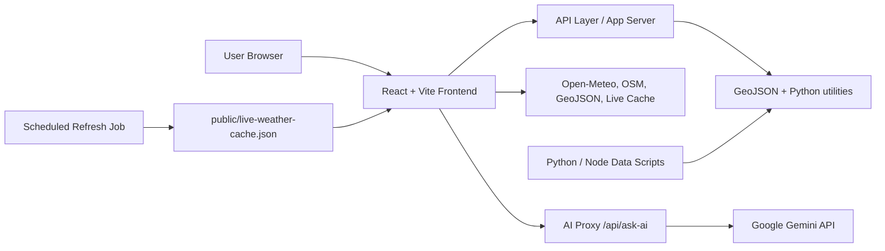

# HeatOps Architecture

## 1. Overview
HeatOps is a multi-layer application designed to collect, process, visualize, and explain urban heat risk across India. The system combines a front-end dashboard, backend AI proxy, scheduled data refresh jobs, and externally sourced climate/satellite datasets.

## 2. High-Level Architecture

## 3. Frontend Layer
### Stack
- React 18
- Vite
- Recharts
- react-simple-maps
- i18next
- Three.js / react-globe.gl

### Responsibilities
- Render India map and state/city drill-down interactions
- Display live weather, AQI, and forecast cards
- Surface heat-risk categories and visual scores
- Run comparison and intervention planning workflows
- Provide AI analyst chat experience
- Support multilingual interface rendering

### Key Modules
- App entry and orchestration in `src/App.jsx`
- Weather and live data hooks in `src/hooks/useWeather.js`
- Data utilities in `src/utils/`
- UI components such as `WeatherCard.jsx`, `AIAnalystPanel.jsx`, `MLModelPanel.jsx`, and `SpatialRecommendation.jsx`

## 4. Backend and API Layer
### Flask application
The Flask server in `app.py` provides server-side processing for geospatial and weather data. It handles:
- GeoJSON district loading
- Feature centroid calculations
- Weather fetch and caching
- Heat-point construction for map and data workflows

### Serverless / proxy layer
The project also includes serverless functions under `api/` and `netlify/functions/` for:
- AI requests through the secure proxy
- Weather cache refresh tasks
- GitHub automation and data commit workflows

## 5. Data Flow
### 5.1 Weather and AQI data
- Open-Meteo provides current weather and air-quality data.
- Results are cached to reduce repeated calls and support stale-aware UI behavior.
- Data may be refreshed via scheduled jobs and live cache files.

### 5.2 Geo and land data
- India district/state GeoJSON files under `public/data/`
- Geo features are used for map rendering and city-localization logic.
- Land-cover and urban morphological metrics are loaded from project assets and derived data products.

### 5.3 AI analysis
- Client sends natural-language queries to the serverless proxy.
- Proxy reads the secure Gemini API key on the server side.
- AI responses are grounded in available metrics and return clear label behavior for estimated values.

## 6. Storage and Refresh
### Local project storage
- `public/data/` stores district, state, and derived data.
- `public/live-weather-cache.json` holds cached weather snapshots used by the app and refresh jobs.

### Refresh pipeline
- Scheduled refresh scripts fetch weather records and update cached results.
- The system commits updated data to the repository and triggers redeploys.

## 7. Security and Trust Model
- API keys are kept server-side and never exposed in the client bundle.
- Synthetic or estimated values are clearly marked instead of being masqueraded as exact live metrics.
- Data provenance is tied to underlying providers such as Open-Meteo, OSM, ESA WorldCover, and ML prediction outputs.

## 8. Scalability and Operation
- Frontend is optimized for responsive map interaction and chart rendering.
- Caching limits repeated weather fetches and reduces latency.
- The system supports national coverage with modular fetch-and-refresh patterns.
- Scheduled jobs decouple live data freshness from UI rendering.

## 9. Architectural Principles
- Real data over placeholders
- Honest disclosure over false precision
- Server-side secrets over browser exposure
- Actionability over simple visualization
- India-first context and language inclusion

## 10. Notable Architectural Decisions
- Use React for a highly interactive dashboard experience.
- Keep AI access behind a backend proxy for security and control.
- Store refreshed weather snapshots in a simple JSON cache for rebuild and redeploy workflows.
- Keep geospatial datasets local or cached to ensure quick map interactions.
- Use modular utility files to separate business logic from views.
